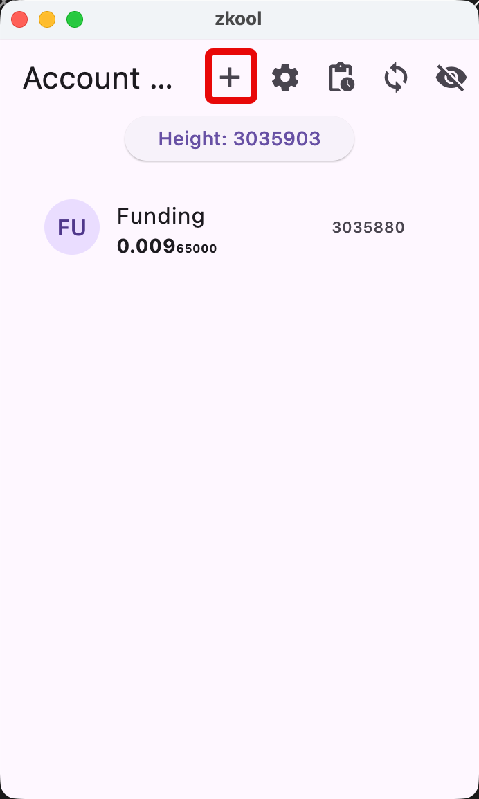
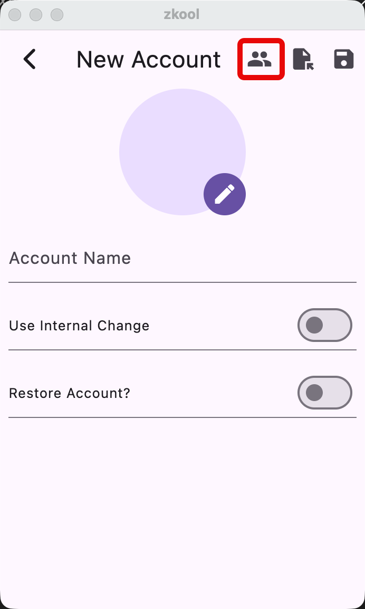
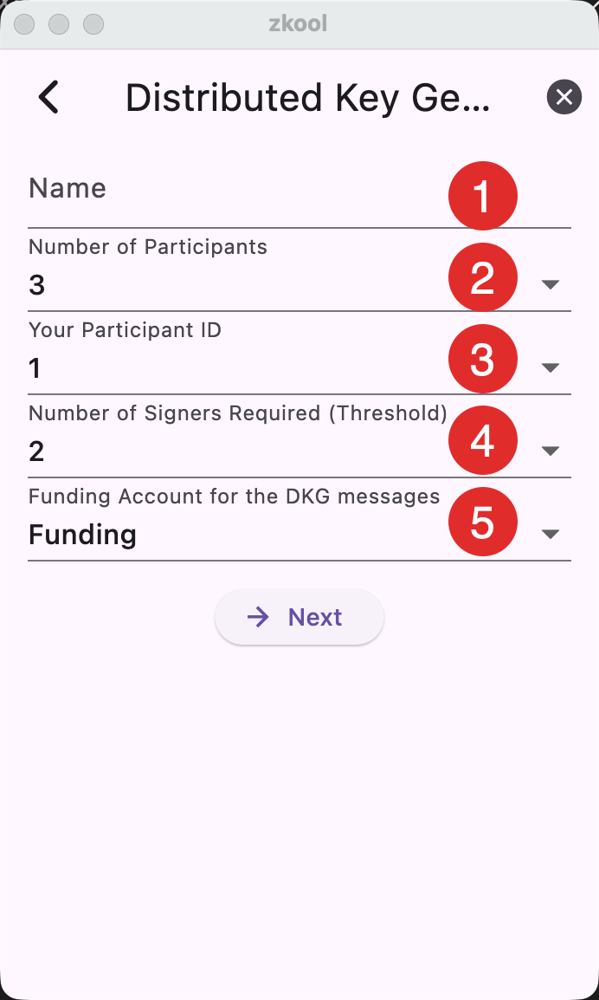
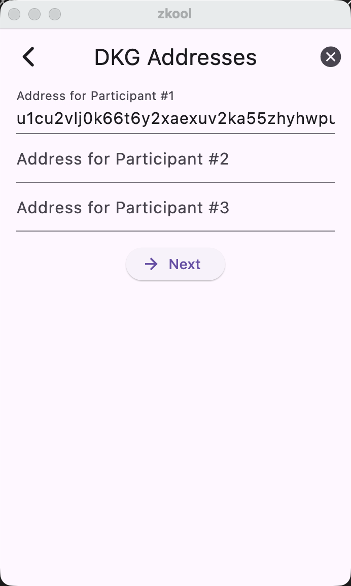
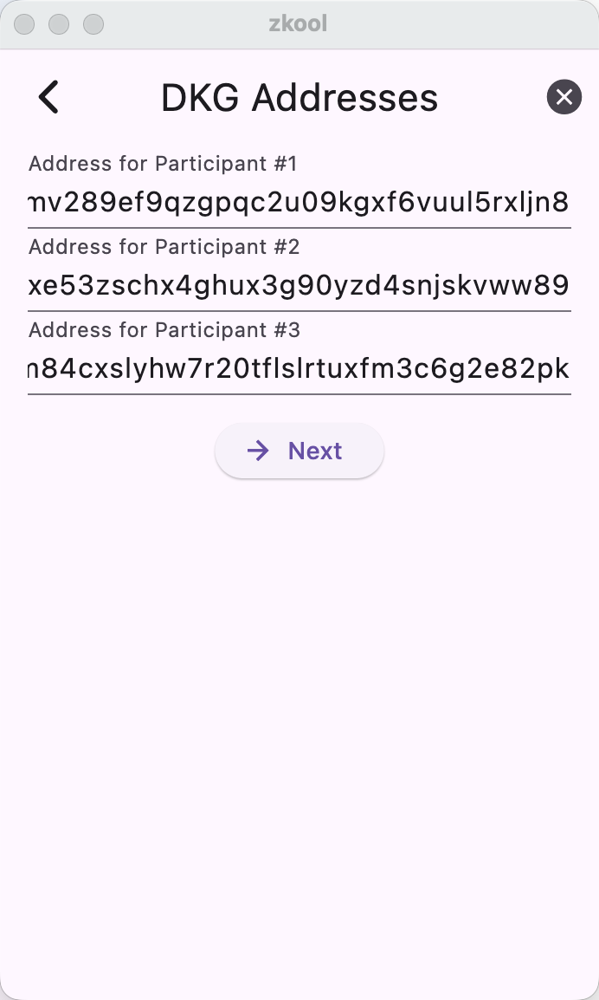
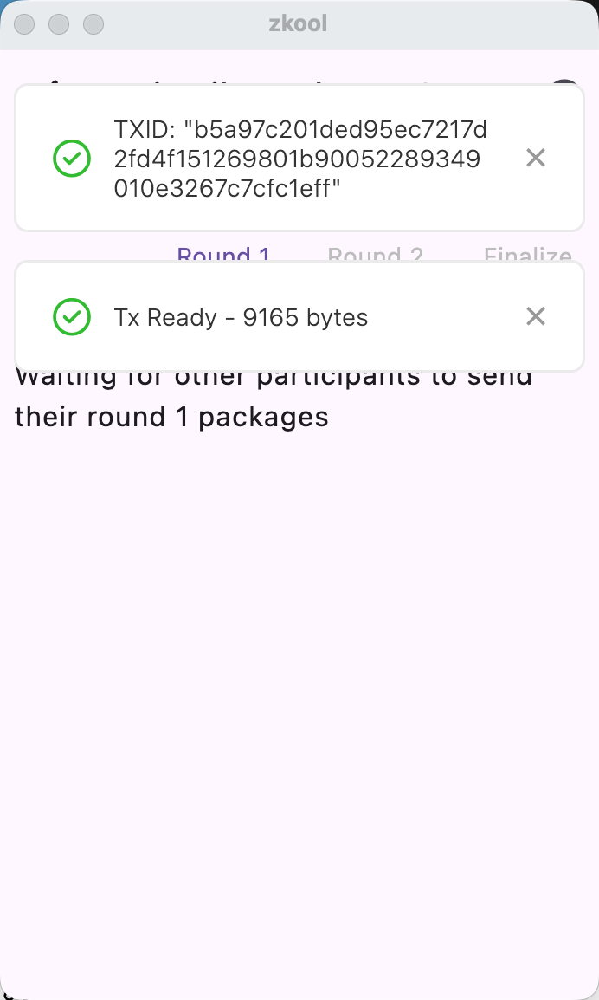
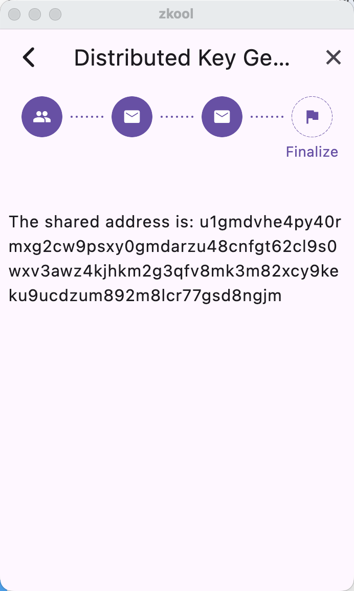
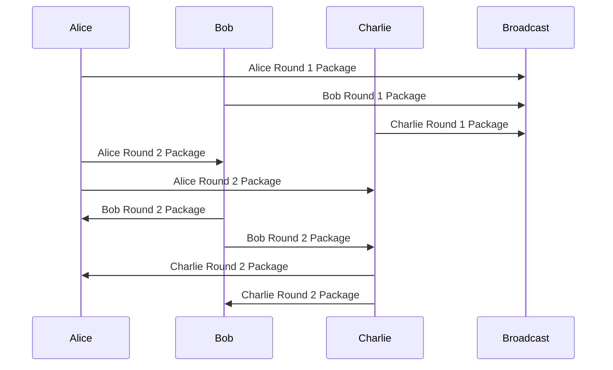

## Requirements

- A funding account with some ZEC to pay for transaction fees. A minimum of 0.0001 ZEC but 0.01 ZEC is safer.
- Between two and five participants[^1]. Everyone must be present for the DKG.

## Overview

- There can only be one DKG in progress at any given time[^2].
- The process is _distributed_. The participants do not have to be in the same
  place. They do not have to run the DKG concurrently. But the process needs
  their Zkool open to make progress. Otherwise, the DKG pauses until then.

## Example

Let's say Alice, Bob and Charlie want to create a MultiSig Account with two required signers.
They should have their copy of Zkool running.
We'll describe from Alice point of view. The other participants are expected to do the same
thing.

## Setup

In the beginning, you should have the funding account. You may have other
accounts but for simplicity we'll assume that the funding account is the only
one you have.

::: important Every participant should have their own funding account.
:::

## Form

Tap on the "+" from the app bar.

Tap on the "DKG" icon. Do not tap on the save button, this would create a
standard account.

Next, we need to fill the following form.

1. Name of the account. This is kept locally. You can choose any name you want
   and it does not have to be the same as the name the other participants
   choose. It can be edited later like a standard account.
2. This is the number of participants. We have 3 participants, so we should set
   this to 3.
3. Your participant ID. Every participant must choose a distinct ID. We'll
   assign Alice to 1, Bob to 2 and Charlie to 3.
4. This is the number of required signers for spending. We said we wanted two
   out of three. This must be between 2 and the number of participants.
5. The name of the funding account. Select the account from the dropdown box.

Once you finished filling the form, press the "Next" button.

## Participant Addresses

Next, you have to fill the participant addresses. You start with a form that
only has your address.

Ask the other participants to give their address. This address is used for the
DKG and SIGN multi party ceremonies. The form must be filled correctly otherwise
the DKG will not succeed.

> Your address should be kept between the participants. It is not critical for
> the DKG protocol but it is preferable not to share it publicly.

::: tip
Now that the DKG has started, **to cancel the DKG you need to tap the cancel button**.
If you simply want to pause it and do something else, tap the back button or
close the app. Resume it by starting the DKG again. Zkool will not ask you to fill
the form if a DKG is in progress.
:::

Once we filled the addresses of the other participants, we can go to the next step.

Zkool prepares and broadcasts the first round of messages. Each participant
sends their message to a common address.

The DKG process continues when every participant has broadcast their round 1
message. Zkool will keep synchronizing automatically when the DKG page is
opened.
If you close the app, you can resume the DKG by restarting it, but do not cancel it.

> Please make sure you come back to this page or leave it open.

::: tip
At this point, DKG is fully automated as long as all the participants leave
their Zkool running. This is the easiest method but **still will take a few blocks**.
The DKG takes about 5-10 minutes.
:::

It ends with a page that shows the shared address. You don't need to copy this
address because an account has been created.

Close the DKG page by tapping the X on the app bar.

## DKG Protocol

- The Broadcast address is readable by every participant.
- The Round 2 Package is sent as one transaction with multiple recipients.

[^1]: The limit of five may be extended in a later version.
[^2]: For a given database.
