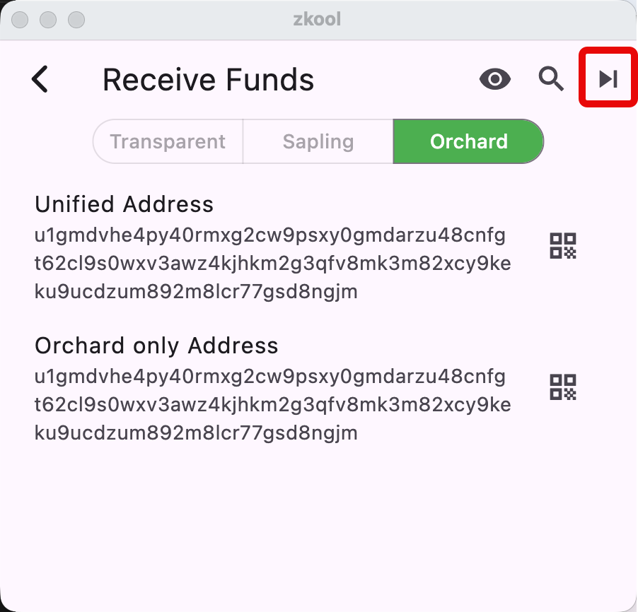
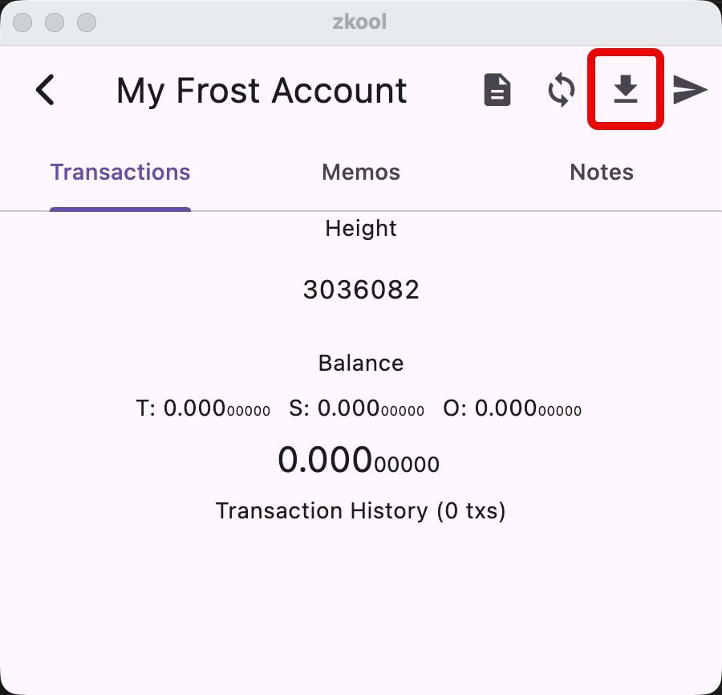
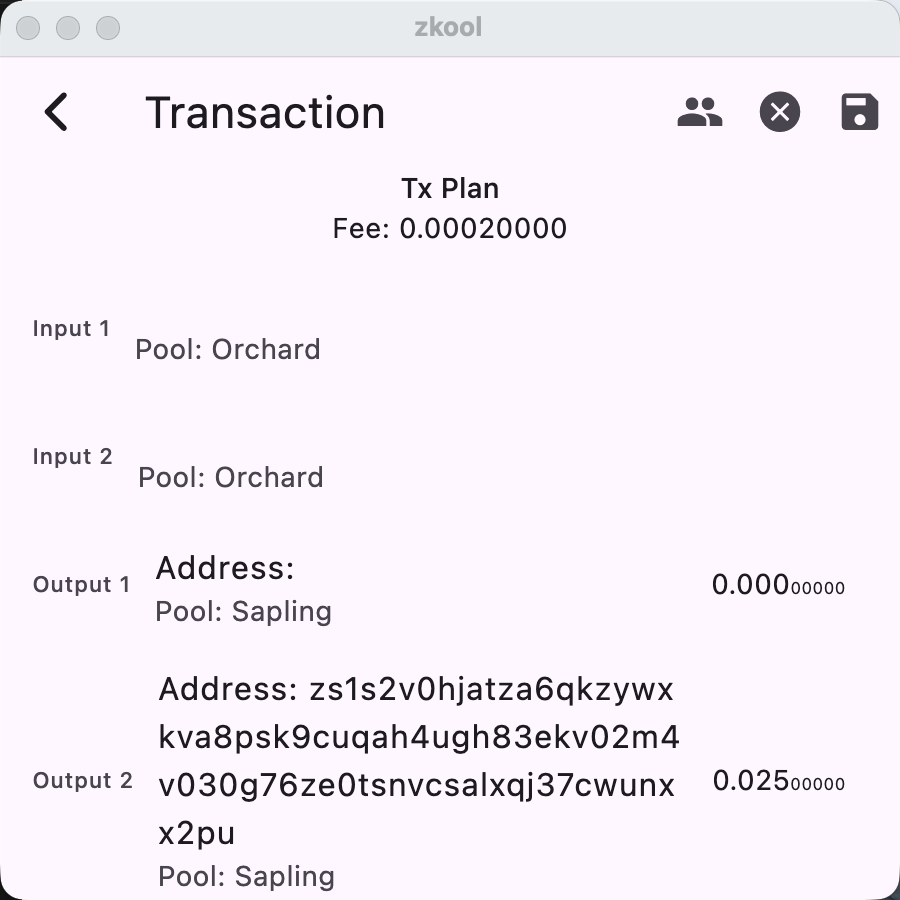
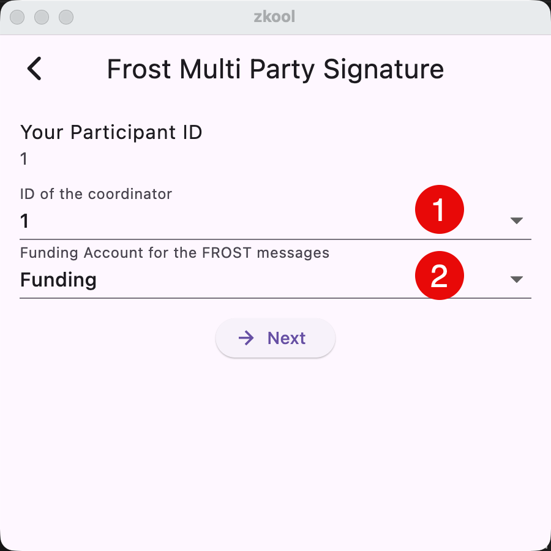
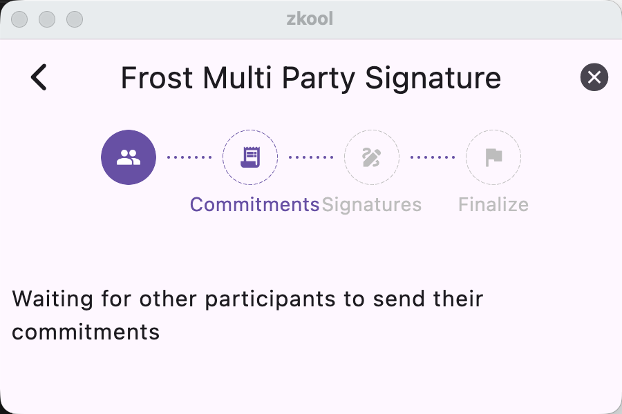
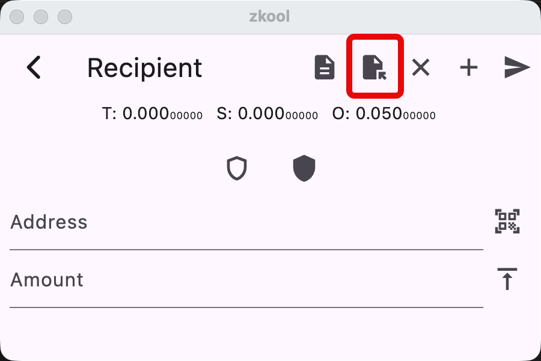
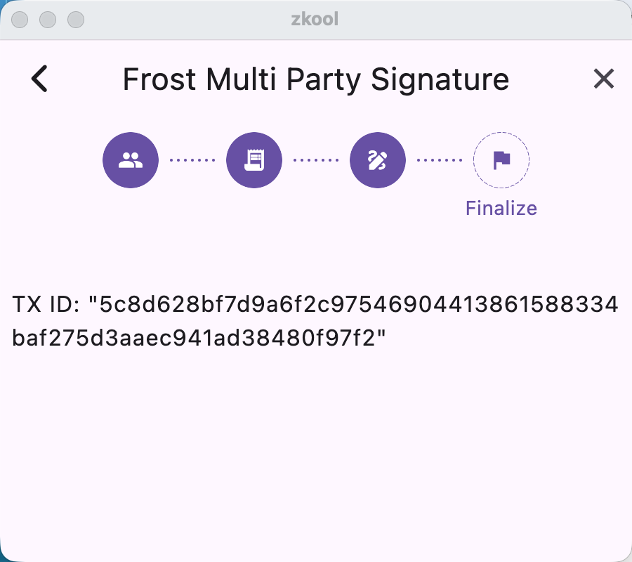
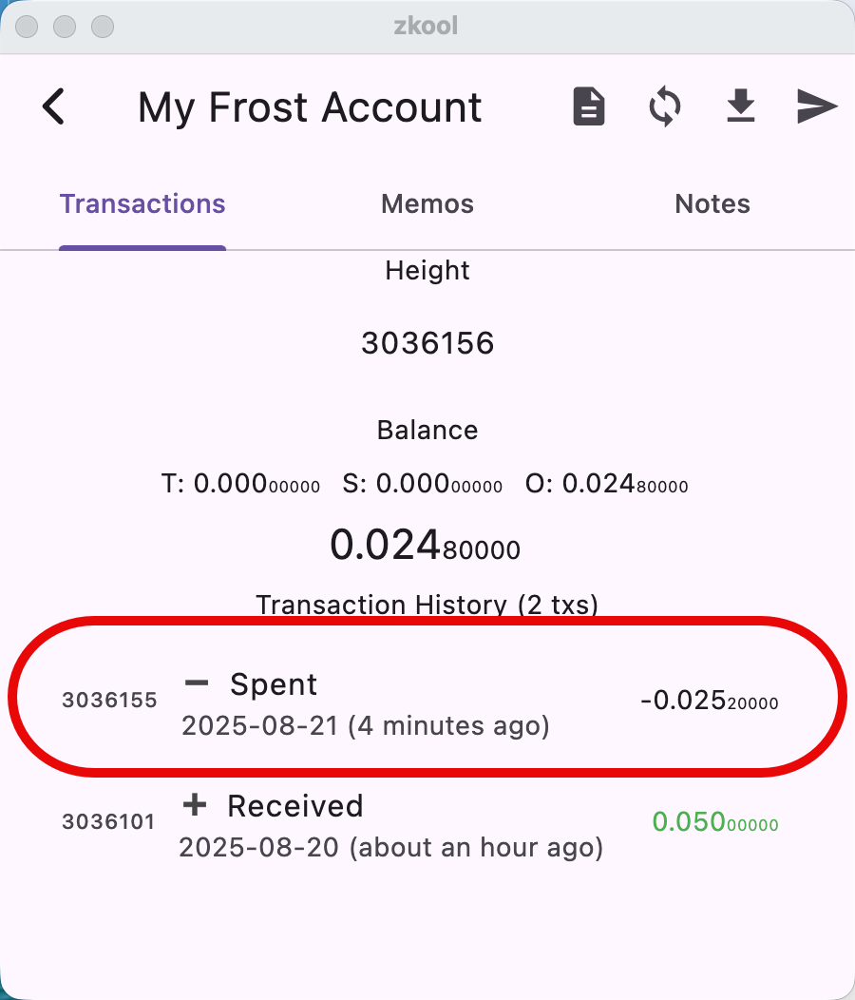

## Receiving Funds

The MultiSig Account works like a standard Orchard account for receiving funds.
The address is on the "Address" page. You can get more addresses[^1] by tapping
on the "next" button.

## Requirements

Like with DKG, you need to have a funding account to pay for the transaction
fees of the FROST SIGN protocol. You should to have ~0.01 ZEC in it.

## Starting a payment

Spending from the MultiSig Account differs from a standard account. It begins
the same way, with the specification of the recipients with addresses and memos.
A multisig transaction can be exactly like a standard transaction: It is usually
input manually or by copy pasting, but it can also have multiple recipients, use
a payment URI, or be loaded from a file.

- Save the transaction by tapping on the "SAVE" button and choosing an output file. This *unsigned* transaction will need to be sent to the other signers.
- Start the SIGN process by tapping on the "MPC" button.

## MPC SIGN

The Signing process requires a number of participants equal to the signature
threshold defined at the creation of the MultiSig Account: The M in "M out of
N". In out example, we need two signers.

The Signing process needs one participant to be the *coordinator* of the Multi Party
Ceremony (MPC). The coordinator is implicitly one of the signer. Typically, they
are also the participant who proposes the transaction.

Since this is a 2 out 3 MultiSig Account, we just need another signer.

1. Enter the ID of the coordinator. Every participant **must** enter the same
   coordinator ID.
2. Select the *funding account*.

Tap the NEXT button to start the MPC SIGN.

### Coordinator

The coordinator waits for commitment messages from the other participants.

### Other Participant

The coordinator must send the unsigned transaction file to the other
participants.
It can be done out of band, by email, by USB, by posting on the shared drive,
etc. The transaction file has the details of the transaction but does not
contain any signature.

The other participants should open the transaction file:
- Start a transaction,
- Tap on the "Load Tx" button and pick the transaction file.

::: important
Every participant should **CHECK** the transaction before signing it.
:::

You sign the transaction you load, and your signature (share) cannot be
tampered. You are safe as long as you make sure to **CHECK** the transaction.

Then tap on the MPC button to start the SIGN process on the participant side.

> The MPC completes on a participant with the message "Signing Completed". They
> can close the page. The coordinator will send the signed transaction once all
> the signature shares are received.

### Finishing up

The coordinator collects the signature shares from the other participant and
adds their own share to form the complete signature. Then it builds the full
transaction and broadcasts it to the network.

Once it finishes, you will see the transaction ID.

> The MPC completes on the coordinator with the Transaction ID.

Once it is mined. It will appear in the account transaction history[^2].

::: tip
As with DKG, the SIGN is automatic as long as Zkool is opened on the multisig
page. If you close it, you can resume the process by loading the transaction and
tapping on the MPC button.
:::

[^1]: Diversified addresses.
[^2]: A MultiSig Transaction is undistinguishable from a standard transaction
    unlike MultiSig in Bitcoin.
