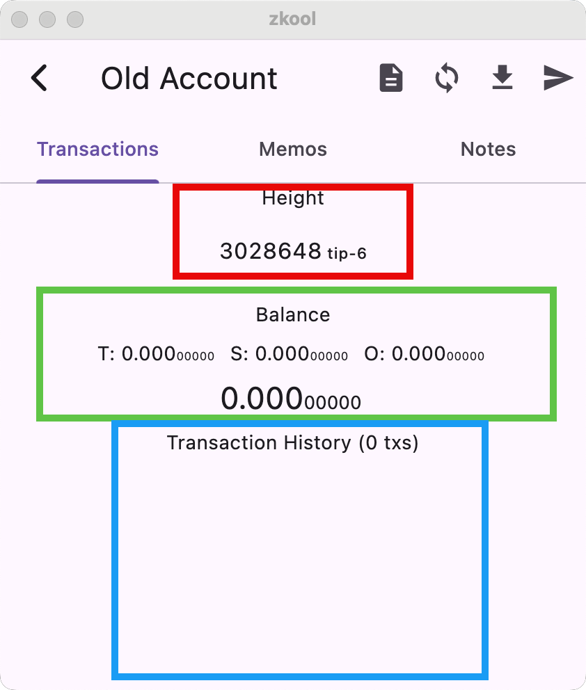
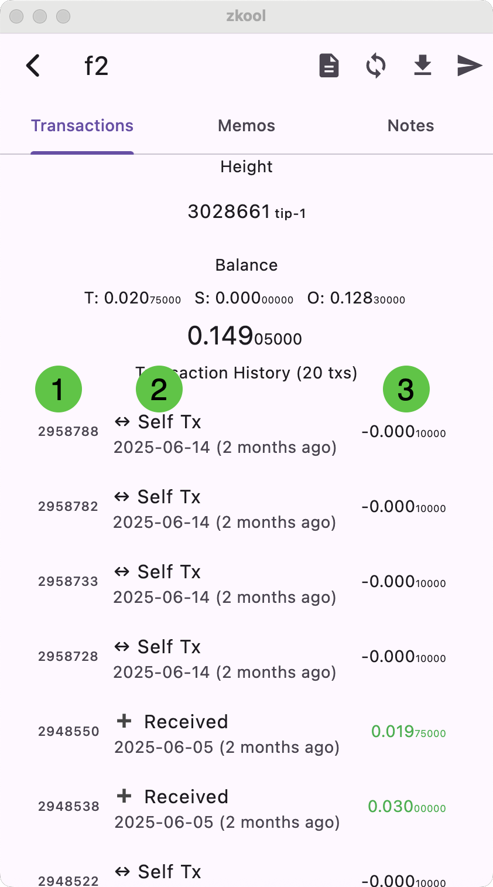

The account page has three tabs:
- Transactions
- Memos
- Notes

## Transactions

The main tab is the transaction tab. It shows
the summary of the account, and the transaction history.

### Height

In the red box, you have the curent account height.
It is the height at which the account is currently synchronized to.
If it is behind the tip of the blockchain (i.e the latest
block), it will also say something like "tip-XYZ" to
indicate that it is XYZ blocks behind.

During synchronization, the height indicator has
a progress bar.

::: note
If you haven't refreshed the current block height[^1], Zkool will not show "tip-XYZ" because it does not know the current height.
:::

### Balances

In the green box, you have the current balance in the
various pools and the total.

::: warning
All funds are made available immediately. Zkool
does not have a note maturity requirement.
:::

But if you want to exclude some notes from spending,
you can do so in the note tab.

### Transaction History
In the blue box, you have the transaction history.
These accounts have no transactions but for illustration
purposes, here's a screenshot of another account that has some.

Each transaction has three columns
1. The height
2. The type and timestamp
3. The amount (in Green when funds are incoming)

The type can be one of:
- Received: Incoming funds
- Sent: Outgoing funds
- Shielding: An internal transfer between the transparent pool and shielded pool
- Unshielding: The reverse of the previous type
- Self Tx: A fully shielded internal transfer
- T Self Tx: A transparent internal transfer

### Memos

The memo tab shows the memos included in the transaction
outputs. If the memo is in binary, it is shown as a
hex string.

::: tip
You can search *text* memos using the search bar.
:::

Tapping on the memo title sends you to the transaction page
for that memo but tapping on the memo text copies it to
the clipboard. *Make sure you tap on the right portion
of the memo.*

### Notes

The notes tab shows the current unspent output notes.

::: tip
By selecting and deselecting notes, you include or
exclude them from spending.
:::

The account balance does not change even if notes
are excluded[^2].

[^1]: By tapping on the height on the account manager,
or automatically with auto-sync.
[^2]: If you exclude some notes and choose
the spend MAX option, the transaction will not have
enough funds.
