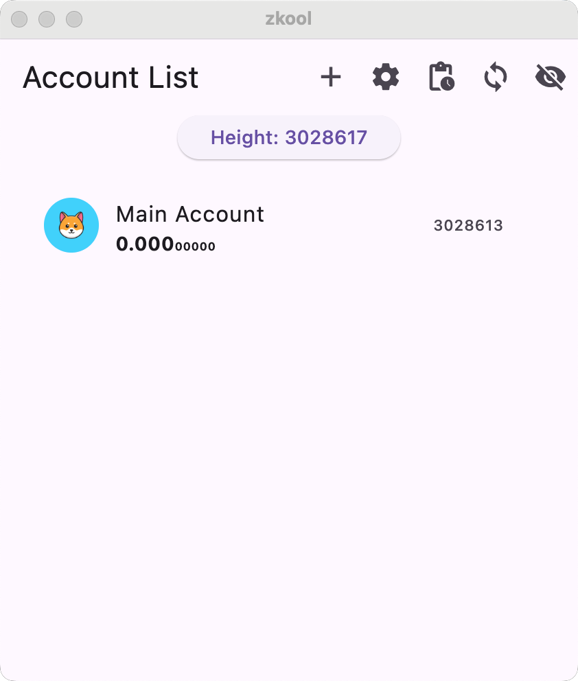

Let's start adding our first account.

Press the "+" button on the app bar.
The New Account page opens up.

## New User
If you are a new user, you probably want a new account.

1. Enter a name for the new account.

The account name is just for you to identify this account
and can be anything you want. It is only kept locally.

2. Optionally, click on the thumbnail edit button and
upload a small picture that will serve as an avatar.

3. Press the save button on the app bar to finish creating
the new account.

Zkool will show you the new account seed phrase.

::: important
You **should** save your seed phrase (the 24 words)
in a safe place. If for any reason the app fails
to work[^1], you will need the seed phrase to recover
your funds.
:::

Either manually copy the 24 words, or tap on the phrase
to copy to the clipboard.

In this example, the seed phrase is "control scan mix boat vendor airport universe note ignore north resemble planet news gadget sport addict route betray check fiction speak violin token entry".

::: important
Keep the seed phrase **exactly** as shown. Do not introduce
spaces, capitalization, or change the order.
:::

Press the Save button once you are finished.

You should have something like:

I called my account "Main Account".

## Restore an old account

If you have used Zcash before and want to
restore funds from another wallet, you need to
use the "Restore Account" option.

Let's walk through this case. First tap on
the "+" button to add a new account[^2]
like before.

1. Enter a name
2. Optionally, upload an avatar
3. This time, switch on "Restore Account"

The tutorial will appear since it's the first time
you use this option. Like before, either go through
it (recommended), or skip.

Now you have a field for the account key.

::: tip
The page may be too long for your device screen
and you may need to scroll down.
:::

Zkool accepts various kinds of keys. The most common
case is the seed phrase, but you can also recover
accounts based on the Sapling shielded secret key,
a private key, a viewing key, etc.

In doubt, just try the key you have. If it is not
supported, Zkool will display an error.

Depending on the type of key you have, you can
get more form fields.

For example, if you are restoring from a seed phrase:

you can also enter

1. an extra passphrase. This is the [extra word]
that you used to customize your seed phrase.
If you haven't used that feature, leave the field blank.
2. an account index. From a seed phrase, a wallet app
can derive multiple accounts. This is used by wallets
like Trezor or Ledger when you have more than one account
for Zcash. The first account has index 0. The second has
index 1 and so on so forth. If you are restoring the first
account, leave the field blank (or enter 0).

::: important
If you are importing a key from Zashi, Zingo, Zcashd
or any wallet that follows the ZIP-316, you must
check the option "Use Internal Change".
:::

ZIP-316 mandates that the change goes to an address
different from the regular receiving address. It keeps
the history of the main address clear of change outputs
but can make synchronization take twice as long.

### Birth Height
The Birth Height is the block height when the account
was created.

::: important
Entering a birth height is needed
when you restore an old account because it defaults
to the current height.
:::

Zkool will not scan blocks prior the birth height and
therefore will not recognize any transaction that happened
before. This is to save on bandwidth and computation since
there may be millions of transactions to scan before
the birth block.

You do not need to enter the exact birth height but the value
you enter *must* be lower than the actual birth height.

### Pools
By default, Zkool will restore a wallet that has every
pool derived by your key. For a seed phrase, that's every
pool. However, you can decide to discard some pools.

::: tip
Discarding pools can increase your privacy and synchronization
speed because Zkool will not request any data from the
server for the discarded pools.
:::

In fact, Zkool will not even derive the keys for the
pools you exclude.

For example, if you do not want to use any transparent transaction, you can
discard the transparent pool.

Press the Save button once you are finished.

::: tip
If you have more than one account to restore, restore
them all before doing the synchronization[^3].
:::

[extra word]: https://trezor.io/guides/backups-recovery/advanced-wallets/what-is-a-passphrase

[^1]: device crash, lost, app bug, etc.
[^2]: it's a new account for zkool, even though
it is an "old" account for you.
[^3]: Zkool can synchronize several accounts concurrently.
