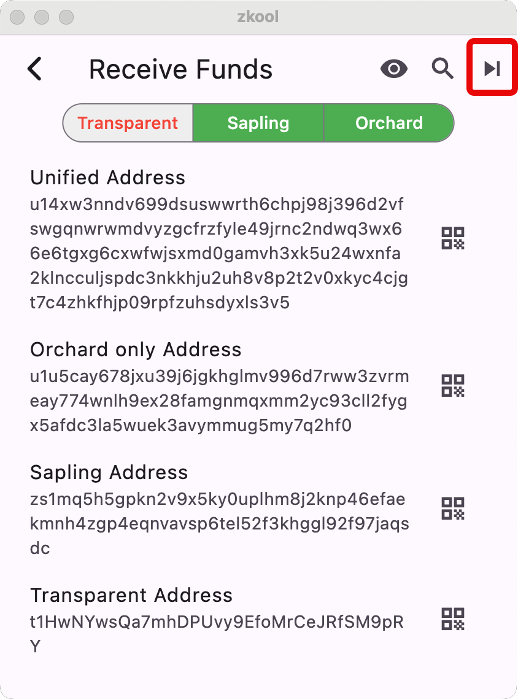

## Receiving Funds

To receive funds, you need to give out one of your account addresses.

They are shown on the receive page.

From the account page, tap on the receive button on the appbar (it looks like a
download icon).

But wait, there are four addresses, and funds sent to any of these addresses
will be available to spend.

So which address should be used?

That depends on the wallet app of the sender and what pool you want to use.

The address that begins with a `t` is for the **Transparent** pool. Using this
address makes the amount and receiver (ie. you) fully public[^1]. However,
transparent addresses are supported by every Zcash wallet, including the multi
currency wallets and the crypto exchanges.

The Sapling address and "Orchard Only" address are shielded addresses. Using
them will hide the details of the transaction. The address and the amount
received are fully hidden from others[^2].

**Sapling** is the "older" shielded technology. It has been superseded by
**Orchard**. However, some older wallet apps may not support Orchard[^3].

And finally, there is the "Unified Address". It is a container of addresses
which can have any combination of Transparent, Sapling and Orchard (except for
transparent alone). Using this address essentially means: "Here are my wallet
addresses, please pick one".

Generally, you expect the sender app to choose the "best" address it can use, ie
Orchard, but fall back to another type.

::: important
A Unified Address can contain a transparent address. You **should
not** assume that every `u` address is shielded only.
:::

Wallet apps are encouraged to present a Unified Address without a transparent
component.

All in all, considering the above, there is little advantage to using a UA that
has more than Orchard:
- If the sender can use Sapling, it likely can use Orchard,
- if the sender cannot use Orchard nor Sapling, it likely cannot use UA either.

::: tip Use the "Orchard Only" if possible. Use Transparent otherwise.
:::

This is sufficient for most users. However, if you want more privacy, you may
need to use **diversified addresses**.

## Diversified Addresses

For simplicity, I'll assume that you are using a seed phrase and didn't exclude
any pool.

You currently have a *set* of addresses: one for each pool. I don't count the
unified address with multiple receivers since it is just a combination of the
other addresses.

An account can have multiple sets of addresses. There are billions of them, all
derived from the same seed phrase at the same account index. They have their own
index. Starting at 0, you have a set. Then at index 1, you have another set, and
etc[^4].

::: tip
To generate a new set. Press the button that looks like a "play next" (in the red box).
:::

The next part is about how the diversified addresses work. You can skip
it if you are not interested in the details but I recommend reading it because
it has some useful information about shielded and transparent address rotation.

The main thing to know is that:

> All the shielded addresses (of an account) use the same decryption key.

When you receive funds at any shielded address, Zkool will be able to decrypt
them and credit your account **in one try**.

Synchronization is a lot of trial and error. We have one key and millions
of transactions. Since we don't want to reveal our decryption key, the wallet
app has to try to decrypt every transaction itself and fail 99.9999% of the time
because we are involved in a very small part of the global usage of Zcash.

So we definitively don't want to try more than one key because that would multiply
the number of attempts at decryption.

The good news is that with Sapling and Orchard, the same key works with any
set.

Shielded decryption is like having a master key to a building. It can unlock
every door but will not work in a different building.

Transparent addresses are different. Every transparent address
has its own secret key (derived from the seed phrase, account index and
address index).

> Transparent addresses use different decryption keys (but
derived from the same seed)

Zkool monitors a few transparent addresses[^5], but it cannot monitor all the
addresses because there are billions. When you generate a new set, the wallet
adds it to its pool of known addresses. This way, it will still recognize
transactions that use previous addresses.

> Wallet apps are expected to use indices sequentially.

For recovery, Zkool just needs to scan a range of indices and stop when it
cannot find any funds after a certain number of attempts[^6].

This takes time and it is not done by default. If you recover an account from a
transparent Zcash wallet that uses address diversification (ie rotation) and
cannot find your funds, it is likely because they are not at the expected index.
Use the scan button on the appbar to initiate a scan. After a while it will
report the number of new addresses found and will add them to the monitoring
pool. Then you need to resynchronize from the birth height.

You do not need to do that when you create new diversified addresses in Zkool
because it knows the addresses it has created[^7].

[^1]: Just like with Bitcoin. You are opting out of all privacy features.
[^2]: Obviously, you and the sender know the details.
[^3]: They are practically extinct by now.
[^4]: Due to some limitation of Sapling, there are indices without a Sapling
address. To keep addresses in alignment, when a Sapling index is invalid, we
skip the whole set, including the Transparent and Orchard parts.
[^5]: Sometimes the one at index 0, or the one with the lowest index.
[^6]: For example if there are no transaction for 50 consecutive addresses.
[^7]: But you need to scan when you restore the account on a different copy
of Zkool.
