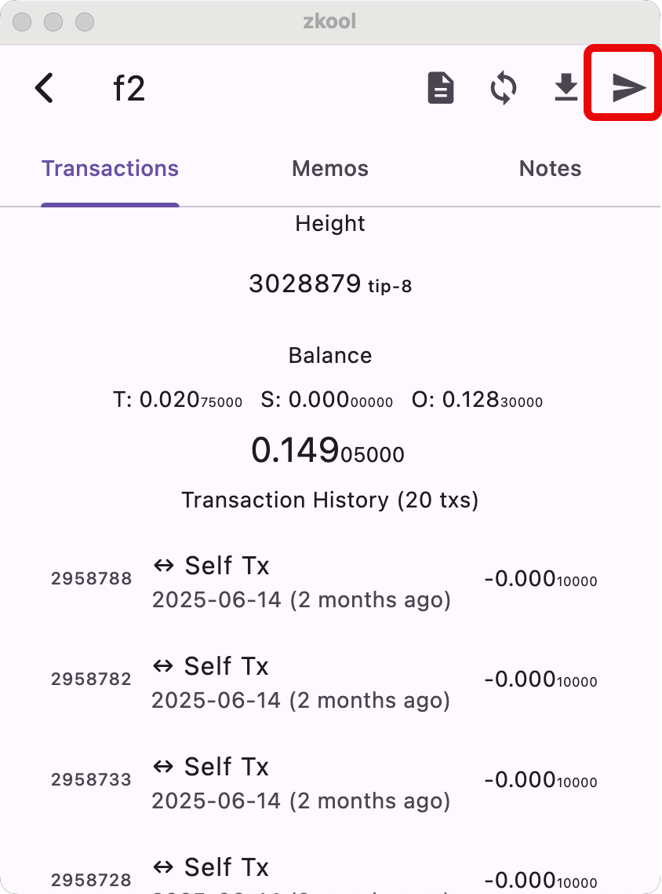
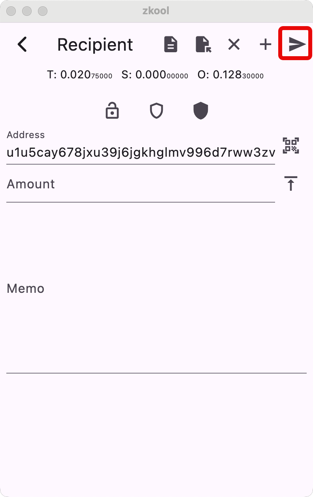
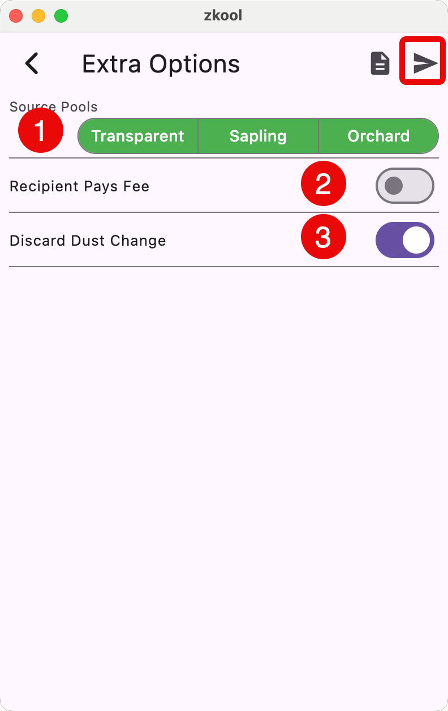
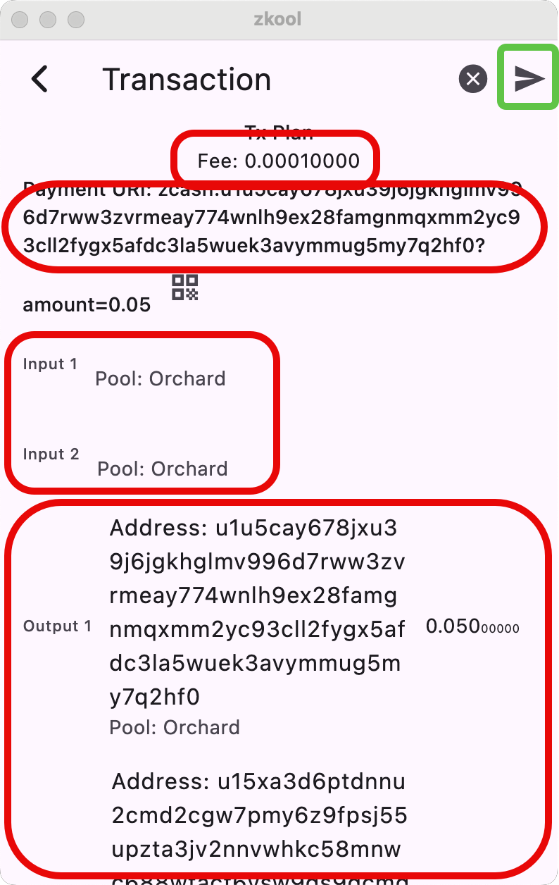
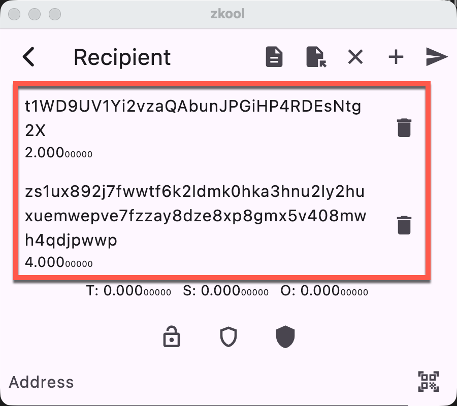

## Basic payments

- Select the account to send from,
- Click on the send button (in the red box),

- Enter the destination address and the amount
- If the destination is shielded, you can attach a memo

::: warning
Transparent addresses do not accept memos.
:::

Click on the send button to continue to the next step.

::: tip In most of the cases, you can leave everything as it is.
:::

Here's what the form means.

1. Choose which pools you allow Zkool to use. Zkool will try to maximize your
privacy by choosing notes that give the most private transaction. But it is not
always possible. For example, if you have Transparent funds, Zkool can use
them if there isn't enough Sapling or Orchard funds. By deselecting a pool,
you tell Zkool not to use it.

> This is unlike most shielded wallets that **NEVER** use transparent
funds of your wallet to send to an external address.

2. By default, you pay for the transaction fees and you
spend more than the amount you indicated on the previous page.
If you switch this on, you tell Zkool to deduct the fees from the amount
sent to the recipient. Fees are automatically calculated based on the network
rules.
3. If you input an amount that makes the change so small that it is below
the "dust" amount, by default Zkool will just drop the change. The network
rejects outputs (including change outputs that are too small). This only
applies to Transparent Change since Shielded Change are hidden to the
node validators.

Click on the "Send" button to continue.

Zkool calculates a transaction and proposes it to you.

You can ignore the transaction plan unless you want
to troubleshoot an issue or see exactly what's going to
be published.

The page shows the fees (related to the number of inputs
and outputs) and a **payment URI** representing this transaction.

## Payment URI

The Payment URI allows you to "save" the transaction if you need
to repeat it. You can copy/paste a payment URI in the address
field of the Send Page or scan the QR code.

See [Payment URI](../recipe/puri.md)

## Coin Control

You can exclude some notes from the transaction by deselecting them in the Notes
tab.

## Inputs/Outputs

The Transaction Plan shows the inputs and outputs with the pool
and amount of the notes.

At this point, you can "cancel" the whole transaction or send it
out.

If you send it, you get a final confirmation prompt and off the
transaction goes.

Close the page by clicking on the close button (X).

## Troubleshooting

If you get an error after trying to send the transaction,
it is usually coming back from the server. Unfortunately
server error messages are not famous for their user friendliness.

The most common cases are:
- transport error: Some network issue prevented the submission
of the transaction to the server. You can retry by clicking on
the send button again.
- the transaction uses some input that was already spent. That
is usually because your account is not synchronized to the latest
block and hasn't seen a transaction that has spent the note.

## Multi Recipient Payments

To create a payment with multiple recipients, instead of tapping on the "SEND"
button, choose the "+".

This adds the recipient to a list.

::: tip
You can select items form the list to edit them, and remove/add new entries too.
:::

The list has the address and amount sent to each recipient, but excludes the
memo field. To see it, select the item to move it to the form.

