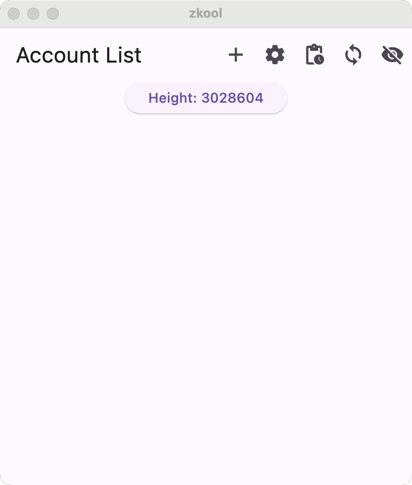

This page covers the basic functionalities
of Zkool.

::: tip
I highly recommend to read this section once
because Zkool does not always work like other wallets.
:::

I am using the MacOS version but the app behaves
similarly on other platforms.

# First Run

## Database Password

Zkool starts by asking for a database password.
It encrypts the wallet file on disk, so that
if your device gets compromised and your wallet file
is stolen, an attacker will need the database password
to retrieve your secret keys.

The database password is not stored and you have
to enter it every time you launch Zkool. If you
don't want to encrypt your database, enter
a blank password.

## Disclaimer

Next, you must accept the disclaimer that states
that Zkool is a non custodian wallet.

::: important
You have full control of your secret keys.
**Make sure to have a backup of the seed phrase**
:::

Your keys are only stored on the device database.
If you lose your device, or reset the data, your keys
and your funds are lost if you do not have your seed
phrase.

It may sound obvious, but make a backup of your
seed phrase **before** you send funds to the account.

Scroll to the bottom of the page, check the "I Agree"
switch and click on the "Continue" button.

## Device Pin

Next, Zkool will ask for your device authentication.

This is the method you used to protect your device, i.e
a pin, password or fingerprint.

On Windows, a password is *not* sufficient. You need
to set a PIN, a fingerprint or face lock.

::: important
You can turn off the pin lock check in the settings
but there are some parts of the app that require
authentication nonetheless. Therefore the device has to have
a lock screen.
:::

You should see the account manager screen now.

## Tooltips

Zkool has a series of tutorial tooltips built in.
The first time you navigate to a screen, you will
see highlighted showcase items. Navigate to the next
item by tapping "Next" or skip the whole tutorial page
by tapping "Skip".

::: tip
You can reenable the tutorial tips in the Settings page.
:::

Once you finish with the tutorial, you will have an empty
account manager list.

