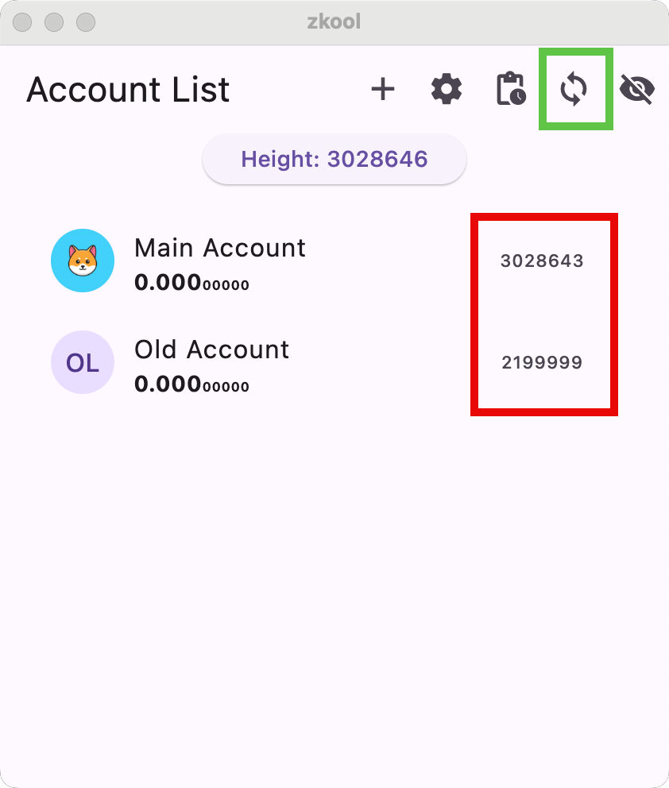

Once all your accounts are entered,
it's time to synchronize.

## Account Heights

Zkool keeps the synchronization state
of each account independent.

This is like your gmail accounts. If you have more
than one, the gmail app
downloads the messages of your current account.
Your other accounts are sometimes behind[^1].

In the screenshot above, you can see the various account
sync heights in the red box. I restored an old account
with a birth height of 2200000, therefore it is up to date
to (the end of) 2199999.

## Auto/Manual Sync

If auto sync is on[^2], Zkool will occasionally check
the current block height and compare it with the account heights.
When an account falls behind by some threshold[^3], Zkool
starts synchronizing it.

If you want to start synchronization immediately, tap the sync
button on the appbar (in the green box).
This starts the synchronization of every account at once.

You can also synchronize a specific account, but first you
have to select it.

Select on account by tapping on its row.

[^1]: gmail may scan from time to time in the background.
[^2]: It's on by default.
[^3]: 30 blocks by default.
