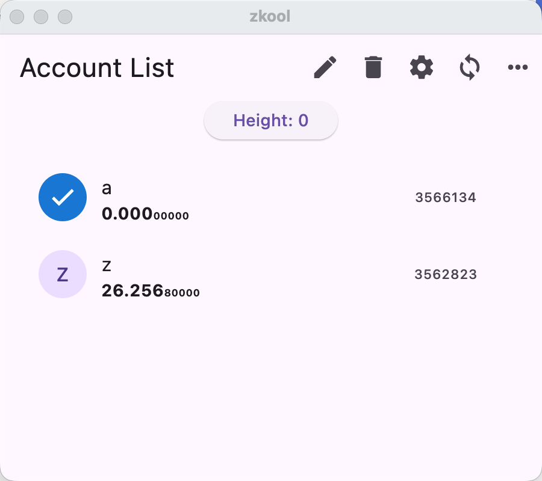
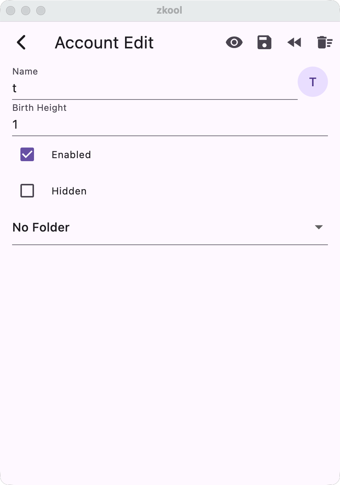
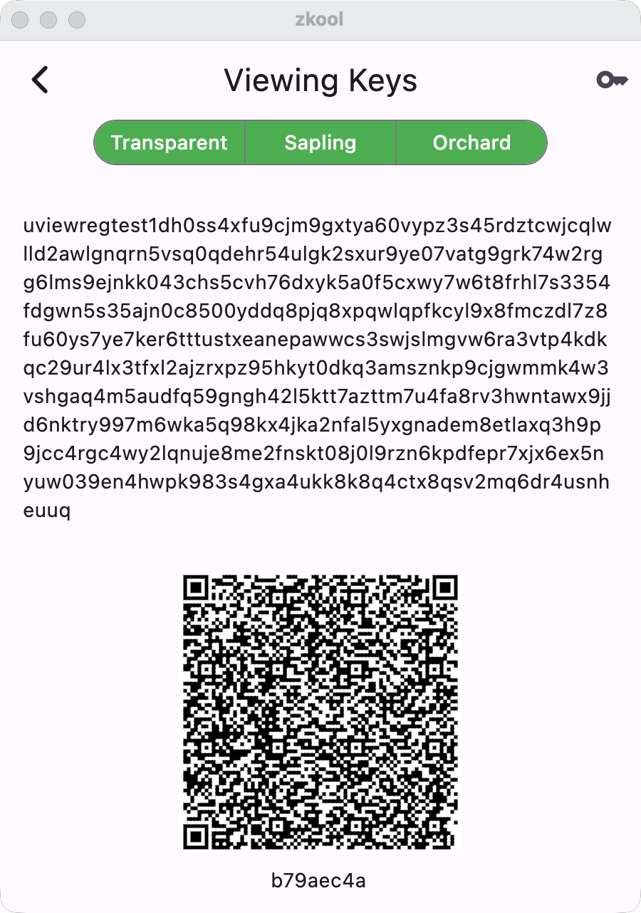

Select one or several accounts to edit by tapping on their avatar.

Then choose the Edit or Delete buttons on the app bar.

## Edit

You can change the account name, icon, and birth height.
Note that changing the birth height does not affect the
current synchronization state. To reset synchronization,
tap the "Clear Sync Data" button.

Disabling an account removes it from automatic synchronization.
It can be re-enabled at a later time.

Hiding an account removes it from the main list. Hidden
accounts are visible when "Show All" is selected.

Accounts can be organized into folders. The main list shows
only accounts belonging to the currently selected folder.

The buttons on the menu are for:
- showing the viewing/secret keys
- exporting the account (and all its synchronization data)
to a file
- rewinding the synchronization state to a previous point
- clearing all its synchronization state

## Show Keys

This page display the full viewing key. You can toggle
part of the key on/off.

::: important
Tapping on the "key" icon shows the *seed phrase* (and
requires authentication).
:::

