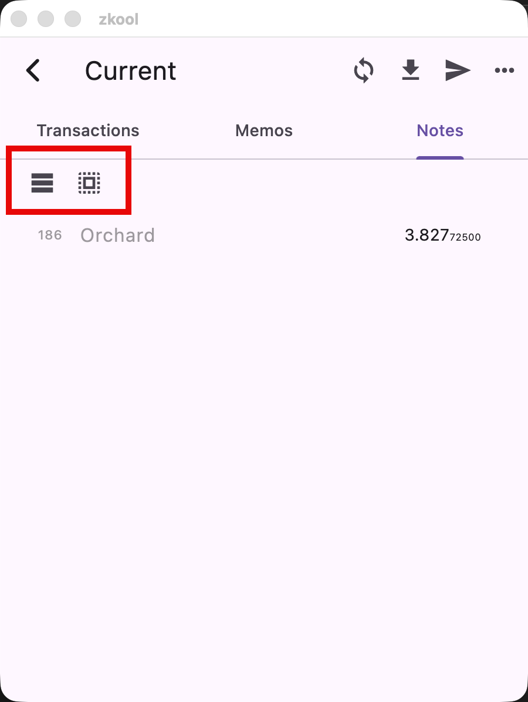

Specific *Notes* can be locked so that they are not used in transactions. For
example, you may want to lock the particular note because it has just been
received.

Another typical usage are mining rewards. Mining rewards cannot be spent before
they mature for at least 100 blocks. Attempting to do so will trigger an error.

Zkool lets you either manually lock specific notes by clicking on them on the
Notes tab[^1] or based on a maturity threshold, like 100.

The buttons are respectively for:
1. Locking based on a maturity
2. Unlocking everything

::: important
Notes in grey are locked.
:::

[^1]: It toggles between locked/unlocked.