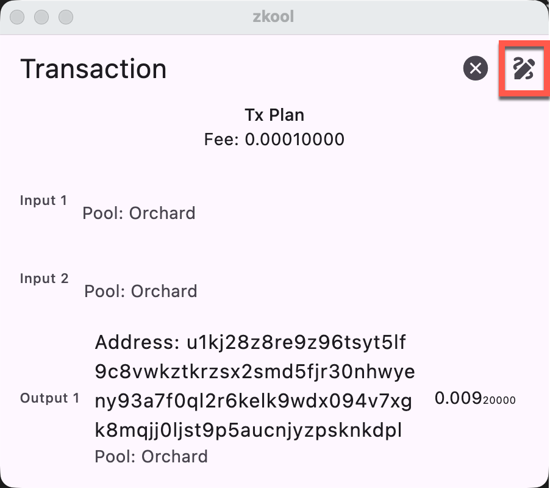
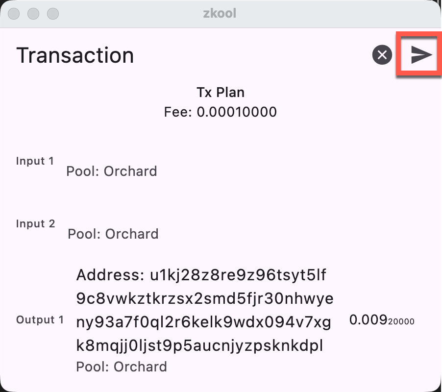

> A Cold Wallet is a wallet that has secret keys but remains disconnected from the Internet **at all times**.

It is not sufficient to be disconnected _most of the time_. For instance, a wallet on a phone that it is turned on only when making transactions is NOT a cold wallet.

To make a payment, there needs to be another wallet that connects to the Zcash network and synchronizes the blockchain data. This wallet has the account _viewing key_ to properly identify the wallet transactions but is not capable of spending any funds. We'll call it the "Hot Viewing Wallet"[^1].

You have two copies of Zkool: The "Hot Viewing Wallet" (HVW) and the "Cold
Wallet" (CW).

::: tip
To make sure the Cold Wallet does not connect to the Internet, you can turn off
WIFI and Mobile Data. Zkool has a setting that puts the wallet "OFFLINE" as
well.
:::

## Setup

1. Start on the CW. Create a new account. Backup the seed phrase to a safe place (do not put the seed phrase on your phone or in the Cloud).
2. Show the UFVK (Edit the account and tap the "Show Viewing Key" button)

::: tip
Scan the QR code on the HVW and restore a wallet using it as the Key.
:::
3. Synchronize it.

::: important
- Make sure you keep the cold wallet offline.
- Make sure you do not have a copy of the seed phrase on a device that can
connect to the Internet.
:::

## Payments

### Step 1: Make the **Unsigned** Transaction

Use the HVW to monitor incoming transactions and verify outgoing payments. To
start a payment from the account, use the HCW and enter the details of the
payment as usual.

Once you reach the final screen with the Transaction Plan, you probably will
notice that the "SEND" icon has been replaced by a "SAVE" icon. This indicates
that the account cannot sign the transaction and is view/watch-only.

Use this to make a PCZT (Partially Created Zcash Transaction) file.

::: tip
Use a *clean* USB drive to move the PCZT file. The file does not have secret
data but contains the details of the transaction. It is better not to put it
online if the transaction has to remain absolutely private.
If your devices have cameras, you can use the [AnimatedQR][1] app on Github
and the Google/Apple Store[^2] to transfer the file via QR Codes.
:::

### Step 2: Sign the Transaction

Load the file on the CW in the account that has the secret key.

Sign the transaction

::: important
Make sure you **CHECK** the transaction before signing.
:::

Save the transaction and transfer the file back to the HVW using the same
mechanism as before but in the reverse direction.

### Step 3: Broadcast the Signed Transaction

Load the transaction on the HVW in the account that has the viewing key.

Press the Send button to send the transaction out.

::: tip
You should check one last time that the transaction is as you want. This is the
final step.
:::

[1]: https://github.com/hhanh00/animated-qr
[^1]: A hot wallet is a wallet connected to the Internet.
[^2]: By the same author
