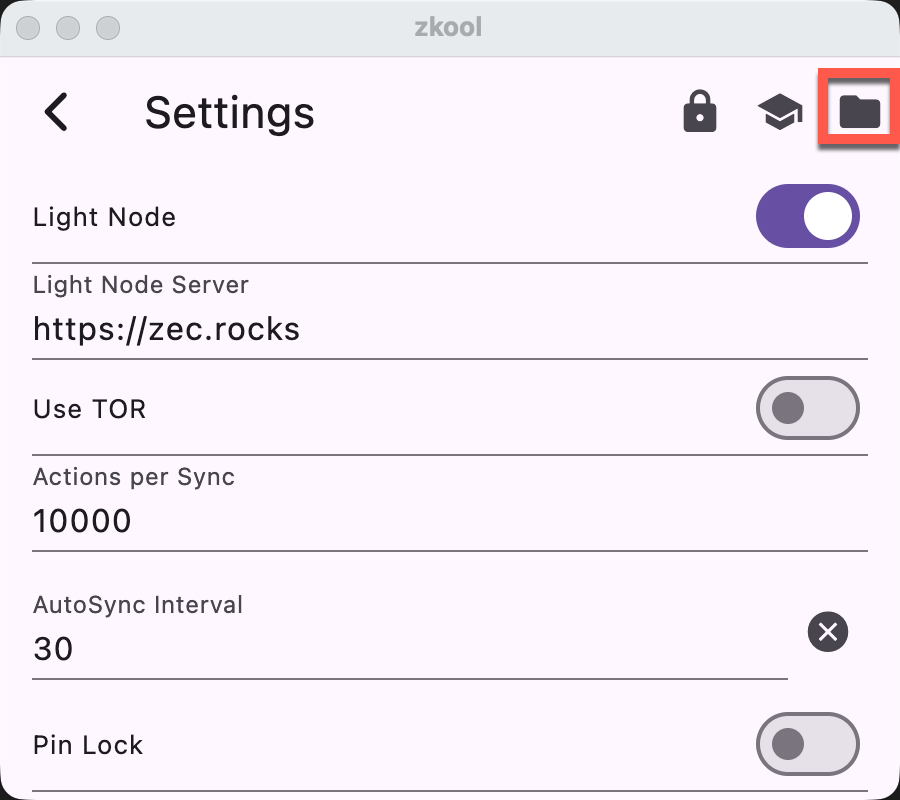
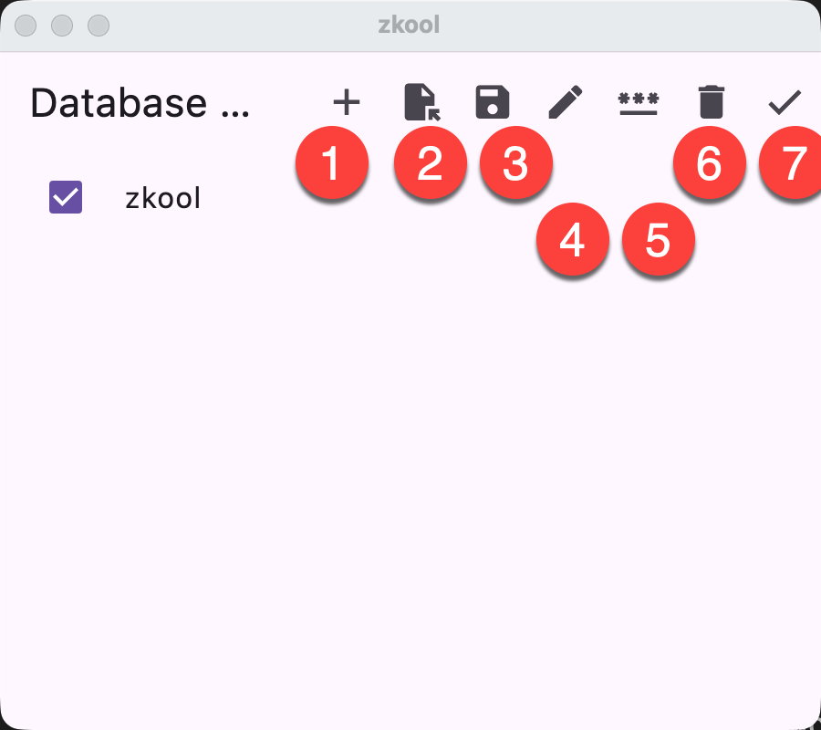

Zkool keeps all the account data and some of the settings in wallet files, which
are Sqlite/SqlCipher database files.

They are regular files that can be copied, moved and renamed outside of the
Zkool *when they are not in use*.

Zkool has a database manager to perform these tasks because the directory where
the app stores its data is out of reach of regular file managers unless the
device is rooted.

Because the database manager acts on the database file, it needs to run *before*
the wallet loads the data from it. This is why it cannot be accessed after the
account list is read.

In the settings, tap on the "folder" icon.

It schedules the opening of the database manager for the *next launch* of the
app then restart[^1].

1. Create a new database
2. Import and *replace* the selected database. This **erases** the current
   contents
3. Save the database file (ie. make a copy). The copy is identical to the
   original file, ie. it has the same password (if any)
4. Edit the name of the database file
5. Set/Unset a password
6. Delete
7. Close and continue

Some of the options are only available once you check the box next to the
database name in the list.

> Tap on a database name to select it as the current database.

[^1]: If you have a database password set, you can also open the database
    manager from the dialog box that asks for the password.
