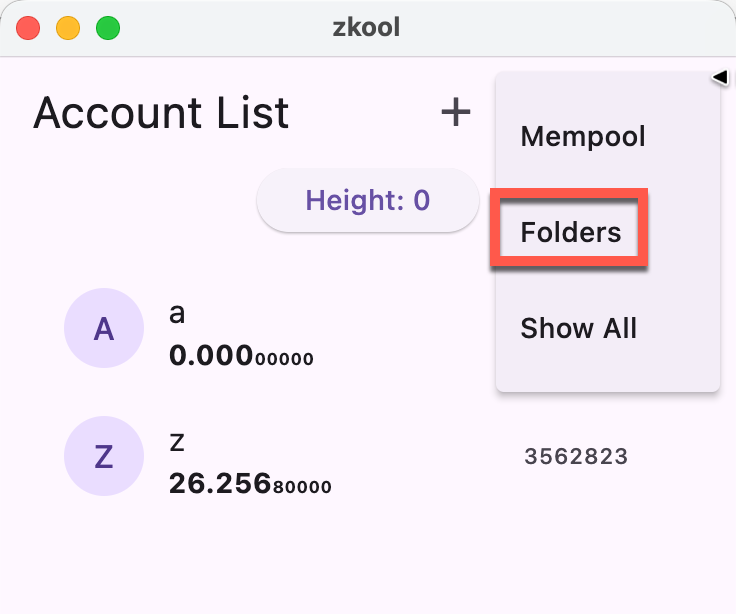

Folders are groups of accounts. By default, accounts are not assigned to any
folder.

The folder menu option from the account manager will send you the the Folder UI.

## Folder Management

There, you will see the classic list editor. Add a new folder by tapping on the
"+" icon. Rename an existing folder by selecting it and choosing the "Edit"
Icon.
Delete one or many folders by selecting them and tapping on the Delete button.

> Deleting a folder does not delete the accounts. It moves them to the
> *unassigned* folder.

Select a folder by tapping on a row, the row will get highlighted. The account
manager will only show the accounts in the select folder.

::: tip
Folder selection is *not* persistent at the moment. When you launch the app, it
shows the unassigned accounts.
:::

Folders cannot be nested.

## Assigning an account to a folder

Edit the account and select the folder in the dropdown list.

::: tip
Folders are an easy way to move accounts from the main page. By default,
accounts that are put in a folder do not show up.
:::

