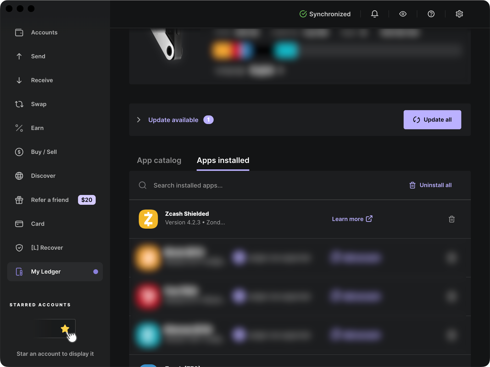
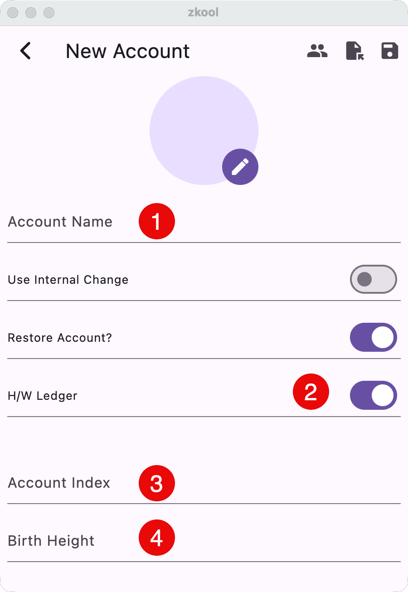
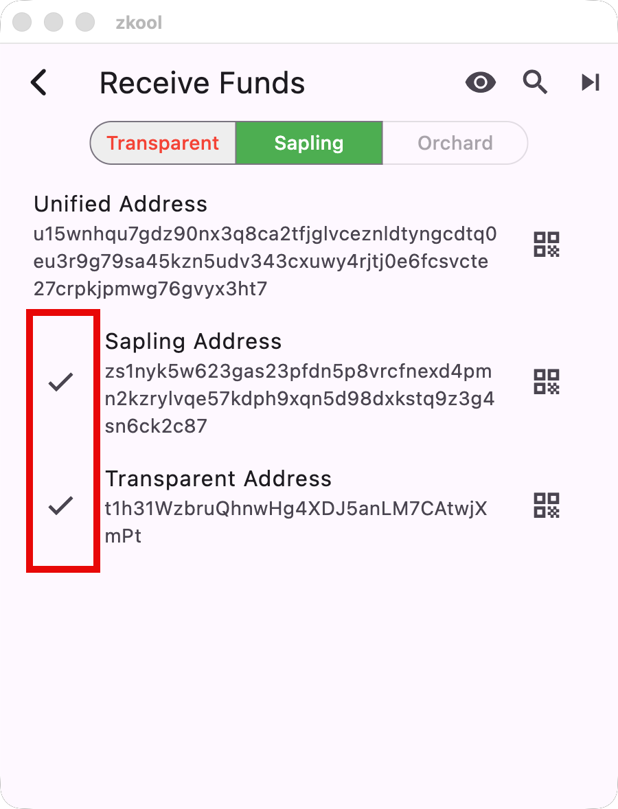

## Requirements

Zkool is compatible with the Ledger NanoS+, NanoX, Stax, and later.
It is _not_ compatible with the Ledger NanoS.

Install the Zcash **Shielded** app using Ledger Live. Look for the app from
**ZONDAX**.

The current version is v4.2.3

::: important
The Ledger App is finnicky. It often stops responding to commands from the
host app without notice. I have the best experience when **I connected the
device, unlocked it and launch the Zcash shielded app before starting Zkool**.
:::

## For Linux Users

If you have permission errors:

From the [Ledger website](https://support.ledger.com/article/115005165269-zd)

- Open the terminal on your computer.
- Run: `wget -q -O - https://raw.githubusercontent.com/LedgerHQ/udev-rules/master/add_udev_rules.sh | sudo bash`
- Try again to access My Ledger or perform the Genuine check.

## Importing a Ledger account

Create a new account as usual, and then enter the following information:

1. the account name
1. **turn on this switch**
1. the account index. 0 for the default account
1. the **birth height**. Enter the block height at which the account was
   created[^1].

Save the new account.

:::warning
Make sure the Ledger is **connected** and **unlocked**. The Zcash Shielded
App MUST be running. Ledger Live or other apps that use the Ledger MUST NOT be running.
:::

> Importing a Ledger account takes around 1 minute. At some point, you will be
> requested to review some addresses/pk on the device and approve.

If the import fails or takes too long, disconnect/reconnect the device and
restart Zkool.

:::tip
When the Ledger performs a task, its UI freezes and the buttons
are unresponsive. If you are waiting and expecting the Ledger
to be working, click on the buttons to check that it is indeed processing.
:::

## Scan Transparent Addresses

If you have received funds in this account, be sure to scan for alternative
addresses because the Ledger Live app rotates addresses.

## Scan

Sync to get the transaction history and balance.

## Receive/Send

To receive funds, you just need the address. You don't need the device itself.

::: important
Verify that the address you use to receive matches the one that your ledger
has. Otherwise you could be sending funds to a hacker's address.
:::

Press the check buttons to make the Ledger show its address and **verify** that
it matches the address in the wallet.

Sending is not different from sending from a regular account. However, the
Ledger App limits a transaction to 5 inputs and outputs of each type
(transparent/sapling).

If your transaction is too complex, you may want to consider using Coin Control
(i.e. locking notes) to limit the number of inputs.

> *Signing a Ledger transaction may take several minutes.*

## New Diversified Addresses

Pressing the new diversified address button will give you a new set of
transparent + sapling addresses. However, the diversifier index associated
with these addresses does not follow ZIP 316[^2].

For transparent addresses, the address index gets incremented by 1.
For sapling addresses, the diversifier index is chosen pseudo-randomly.

## ZIP-32

The Ledger App does not derive the sapling account according to ZIP 32 because
ZIP 32 requires access to the seed phrase that is protected by the OS[^3].

[^1]: an earlier block works too.
[^2]: due to a bug in the current Ledger App.
[^3]: for security reasons, apps do not have direct access to the seed phrase.
They register for a given derivation path and only get the secret key at that
level.
