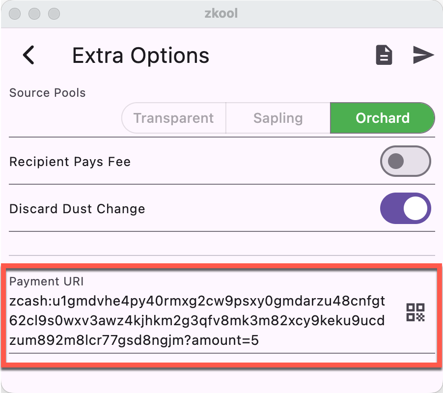

## Using Payment URI

When you scan or copy/paste a payment URI in the address of the Send page, it will get parsed and populate the form[^1].

## Making a Payment URI

When you make a payment, the second page shows the payment URI.

::: tip
Tap on the T/S/O of the account balance to copy the corresponding address to the address field.
:::

[^1]: Multi recipient payment uris are imported as multi recipient transactions.