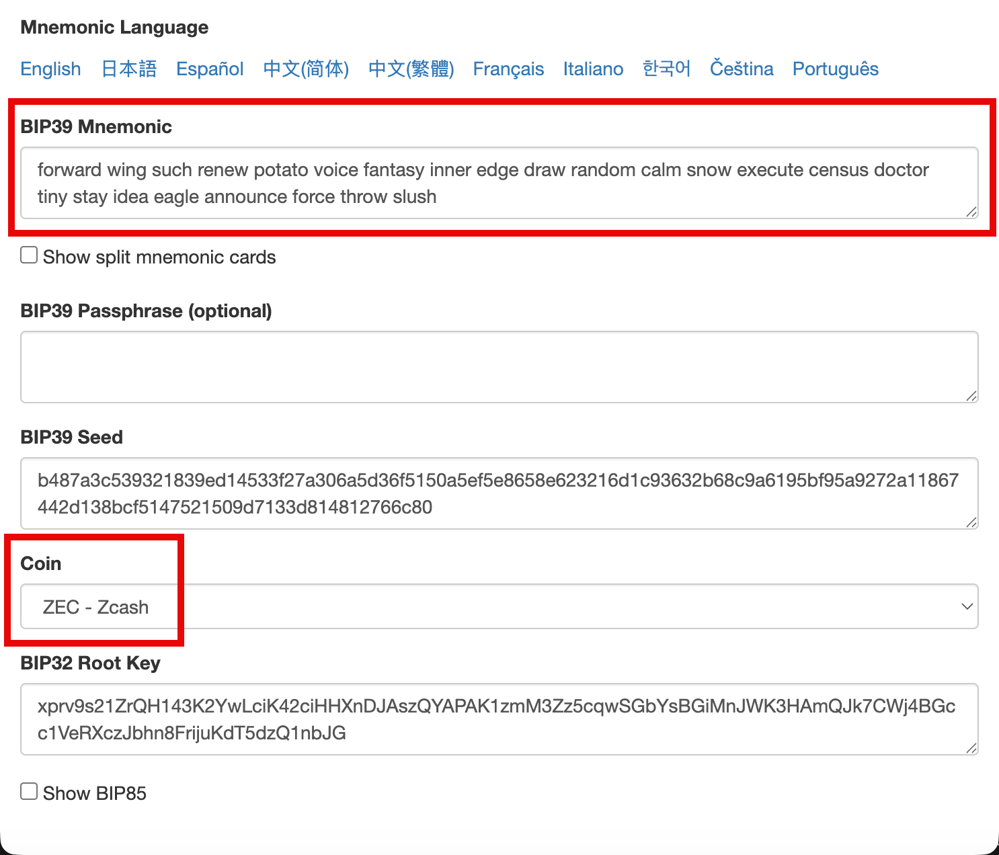
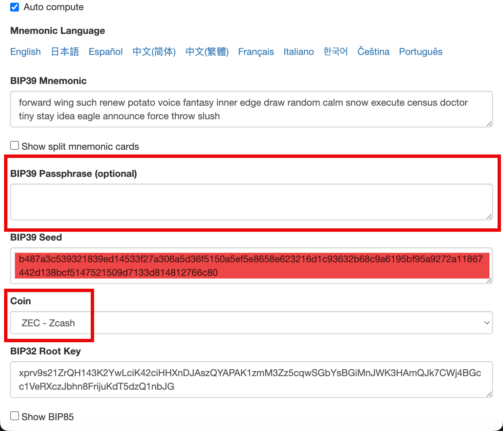
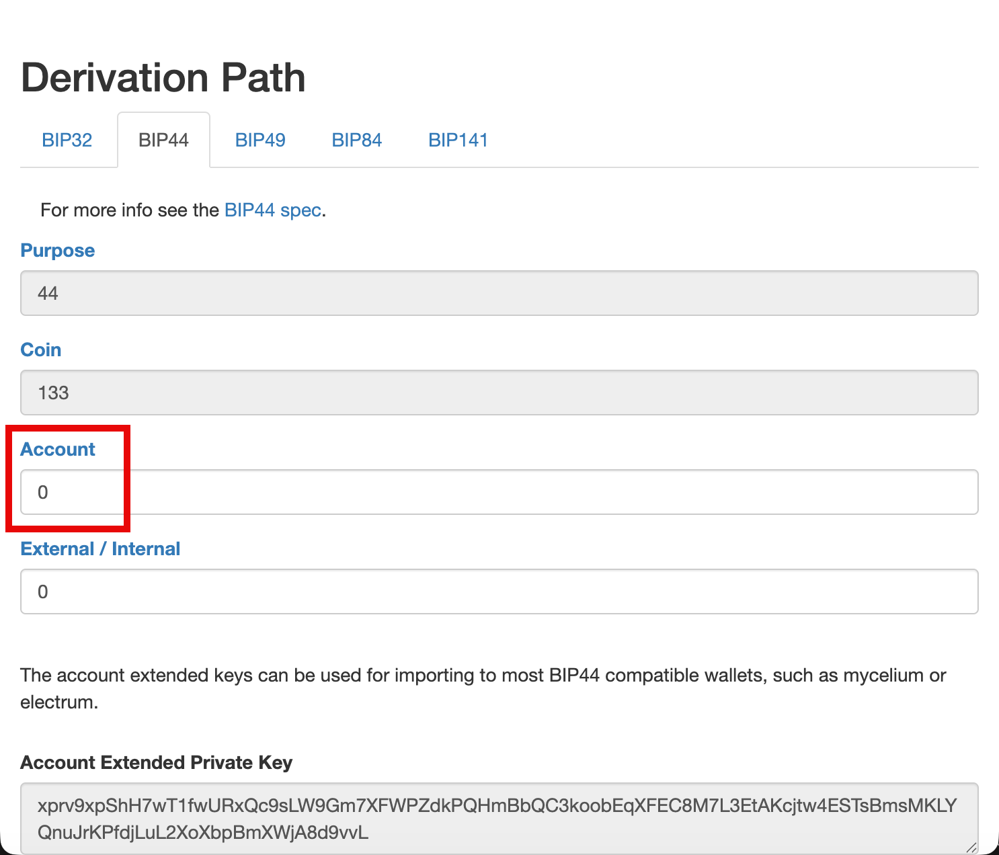
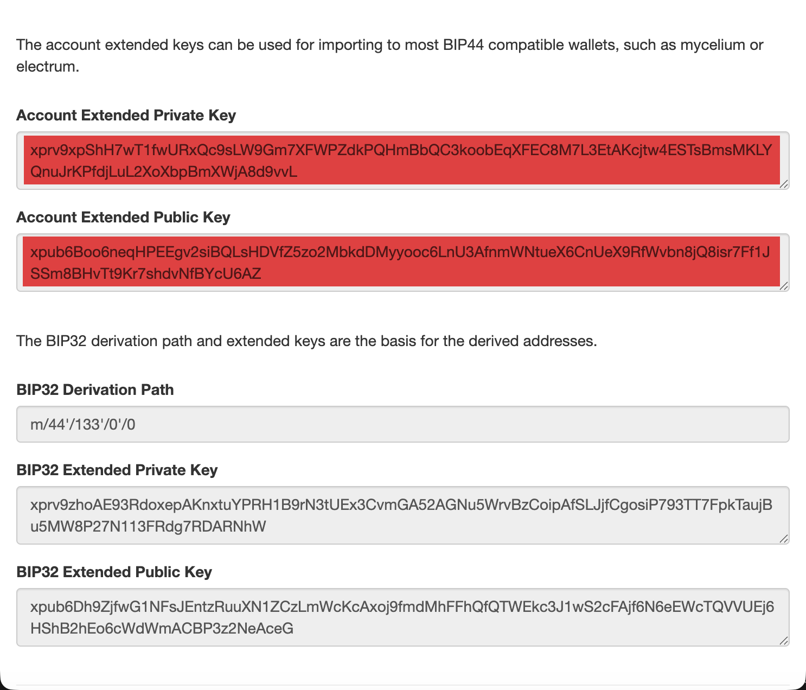
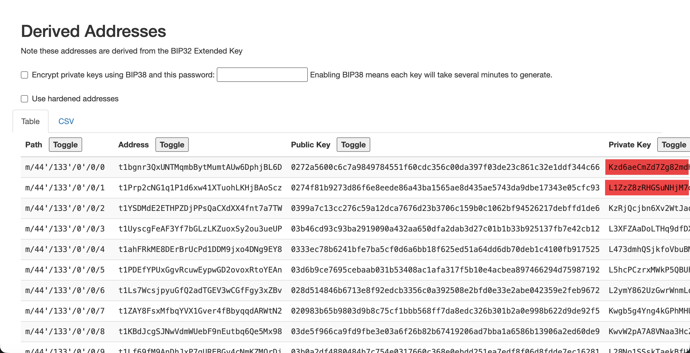

::: tip
You do not need to know all these details. This is only shown for educational
purposes.
:::

## Mnemonic Phrase or Seed Phrase

The website [Mnemonic Code Converter](https://iancoleman.io/bip39/)

is a useful tool for experimenting with seed phrases. We'll use it to illustrate
the key types supported by Zkool.

Zkool supports 12, 15, 18, 21, 24 word seed phrases[^1]. 3, 6, 9 word are deemed
too insecure. We recommend using 24 word seed phrases. Zkool will only generate
this type of seed phrase.

The passphrase can be complemented with an arbitrary password (or sentence) of
your choice[^2]. This gives the BIP 39 Master Seed.

## Transparent Extended Key

> Make sure you select ZCASH as the coin.

When you scroll down the page, you will see a form about BIP 44 derivation path.

The "purpose" is set to 44 which is BIP-*44* and the coin is set to 133 (Zcash
was assigned 133)[^3].

The remaining options are "Account" and "External/Internal".

Account is the *Account Index* in Zkool. External should be left to 0 for imported
accounts. Other values are used internally for change and temporary
addresses.

This gives you the Account public and private extended keys. These keys allow
you to create the primary transparent address and generate *additional
addresses* for the change and for better anonymity.

For example, a seed phrase of "forward wing such renew potato voice fantasy
inner edge draw random calm snow execute census doctor tiny stay idea eagle
announce force throw slush" with no password and account index 0 gives
"xprv9xpShH7wT1fwURxQc9sLW9Gm7XFWPZdkPQHmBbQC3koobEqXFEC8M7L3EtAKcjtw4ESTsBmsMKLYQnuJrKPfdjLuL2XoXbpBmXWjA8d9vvL"
and
"xpub6Boo6neqHPEEgv2siBQLsHDVfZ5zo2MbkdDMyyooc6LnU3AfnmWNtueX6CnUeX9RfWvbn8jQ8isr7Ff1JSSm8BHvTt9Kr7shdvNfBYcU6AZ".

The xprv key allows Zkool to derive secret keys and addresses. The xpub keys
only allows the derivation of addresses.

xprv keys are derived further into secret keys and addresses, using the
`external/adddress index` path.

::: important
Transparent "diversified" addresses have distinct secret keys. They have to be
queried separately. This is not a big issue because the server builds a lookup
index, unless hundreds of addresses are probed.
:::

This is BIP-44, the standard for *transparent* address derivation.

## Private Key

Zcash wallets that support transparent addresses sometimes derive a single
address and export its private key directly. Such wallets do not implement
address rotation.

A Zcash private key begins with `K` or `L`.

## Shielded Extended Key

Shielded Address derivation works completely differently.

Shielded Keys are derived using another standard specific to Zcash: [ZIP-32][1].
It covers both Sapling and Orchard keys.

ZIP-32 begins with a Master Seed derived by BIP-39, i.e. it is the same Master
Seed from the mnemonic and passphrase.

Then Sapling derives *expanded spending keys*[^4] from the seed and the account
index[^5].

The Sapling key has an external encoding. It begins with
`secret-extended-key-main`. Zkool can import them.

Orchard derives a *spending key* too. It has different components than Sapling
but has the same capabilities. Orchard has an encoding too:
`secret-orchard-extsk-main` but these are *not* supported by Zkool[^6].

## Viewing Keys

A public blockchain or transparent address exposes the complete history of
transactions. With a shielded address, the history is encrypted.

There is a type of keys, the (full) viewing keys, that allow the decryption of
the transactions related to their associated address.

Sapling has legacy viewing keys: they begin with `zxviews`. Orchard has no
specific encoding for their viewing keys but one can use Unified Viewing Keys.
They begin with `uview`.

## Unified FVK and Addresses

Starting with Orchard, addresses and viewing keys do not have their own
character encoding like Transparent and Sapling do. Of course, they still have a
*binary* representation. For instance, an Orchard address is represented by 43
bytes as specified in the section [Orchard Raw Payment Addresses, Protocol Documentation][2].

Orchard and future pool addresses use the Unified Address encoding. It is
essentially a container of binary addresses (called receivers). It is similar to
how MP4 files can have different types of video stream (H264, H265, etc). A UA
can have *one instance* of one of the currently active pools (Transparent, Sapling
and Orchard), ie a sapling and an orchard receiver but not two orchard receivers.

The same applies to viewing keys. A Unified Full Viewing Key (UFVK) can also
contain one instance of a viewing key for one of the active pools[^7].

Zkool supports any type of UFVK[^8].

::: important
There are more types of keys such as incoming viewing keys, outgoing viewing
keys, unified secret keys, etc. At the moment, there are not used much in
production and Zkool does not support them.
:::

[1]: https://zips.z.cash/zip-0032
[2]: https://zips.z.cash/protocol/protocol.pdf
[^1]: Also called mnemonic phrases.
[^2]: However, not every hardware wallet vendor supports them, or they limit it
    to a password.
[^3]: If not, check that you set ZCASH as the coin in the dropdown box.
[^4]: a combination of the authorization spending key *ask*, nullifier key *nk*,
    output viewing key *ovk* and diversifier key *dk*.
[^5]: ZIP-32 supports non-hardened and hardened derivation, but in practice we
only use the hardened derivation.
[^6]: At this moment, we don't have support for parsing these keys.
[^7]: Transparent pool uses xpub, Shielded pools use Full Viewing Keys.
[^8]: Sapling UFVK also has its own native encoding.
