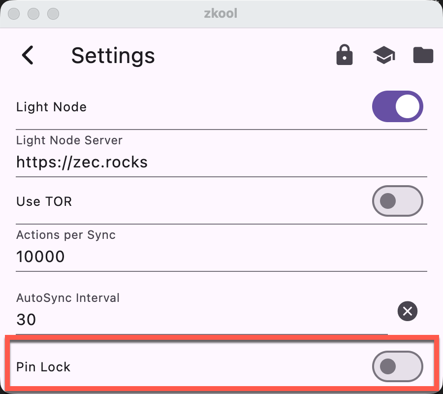

These are security recommendations.

## Database Password

Set a database password. It encrypts the database on your device and prevents
loss of funds if your device or wallet file is stolen.

See [Database](../recipe/database.md)

## Pin Lock

Set a PIN or Fingerprint biometrics on the device (if supported). Zkool will ask
to authenticate whenever it opens and resumes.

> The PIN is set in the device Operating System. Zkool does not have a PIN code.
> On Windows, a password is *not* an acceptable authentication method. You must
> use a PIN, face lock, fingerprint or hardware token.

## Account File Password

Make a backup of your accounts, they include the synchronization data. Also make
a backup of the seed phrase. They are portable and can be used to restore the
account in Zkool or a different wallet application (provided they support the
features used by the seed phrase[^1]).

See [Account File](./database.md#account-file)

[^1]: For instance, if an account index or password/passphrase was used.

