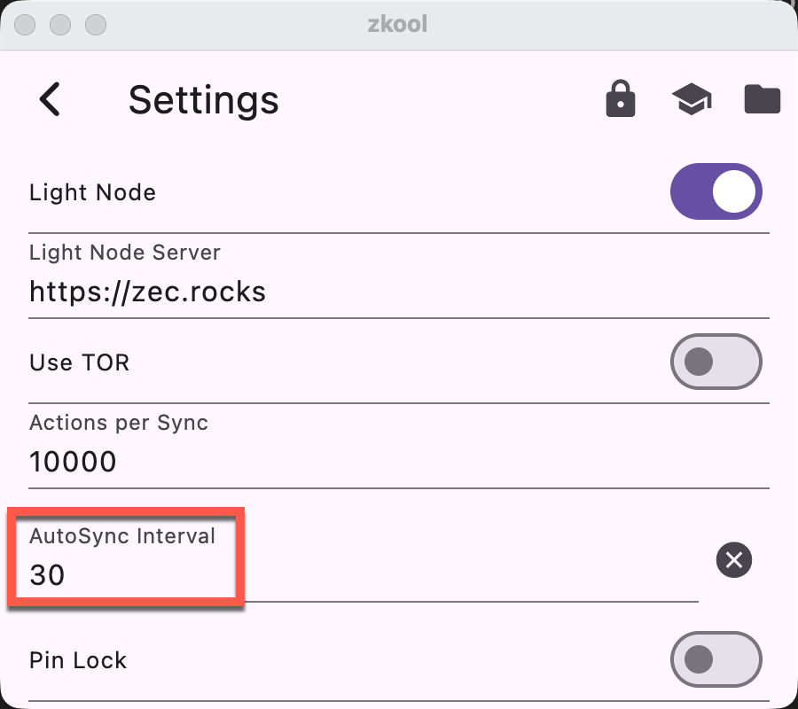
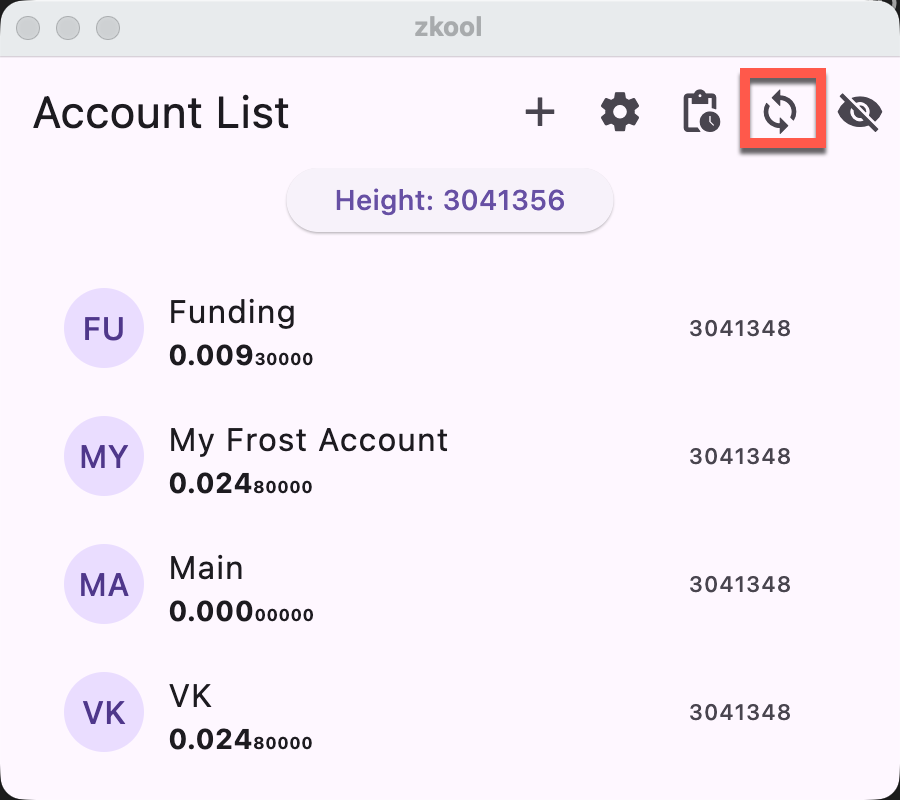
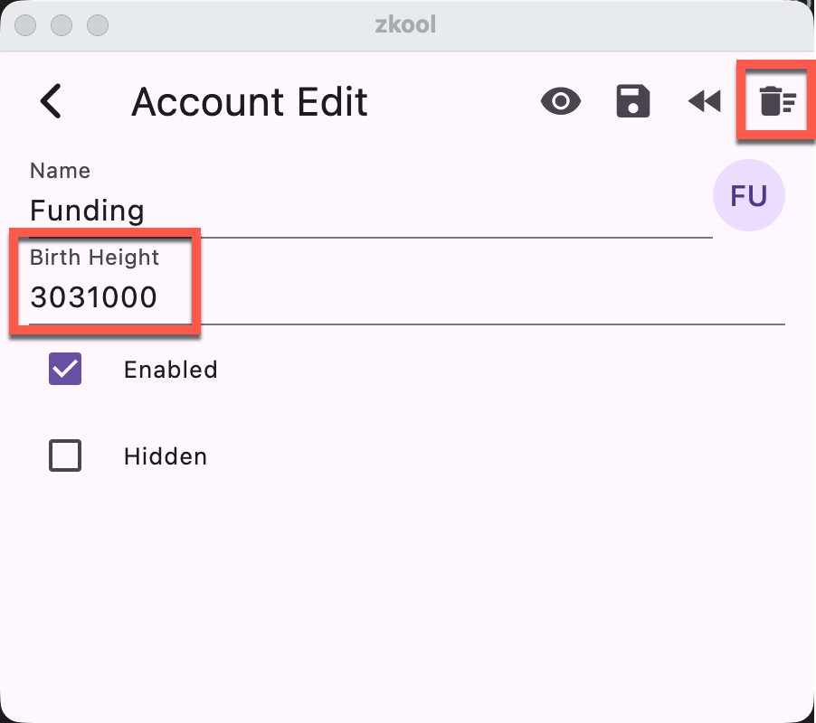
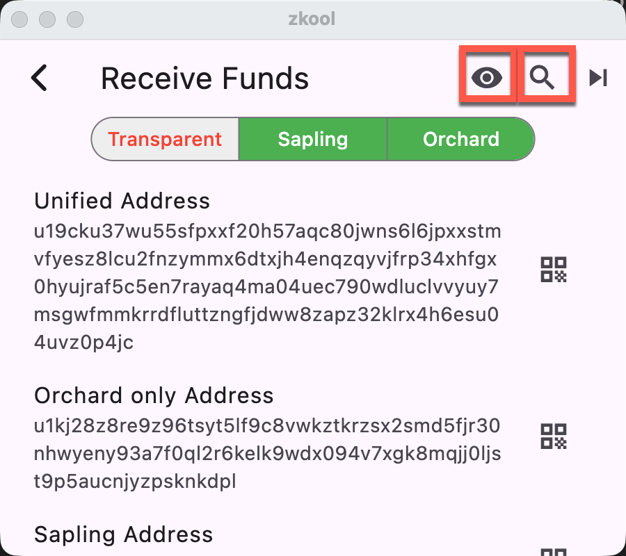
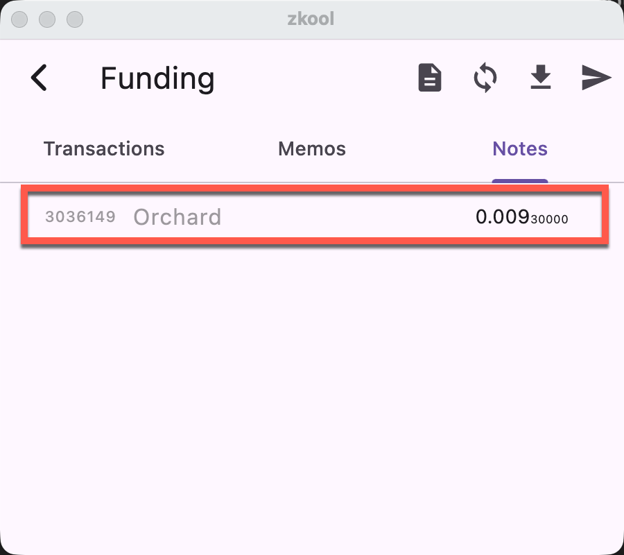
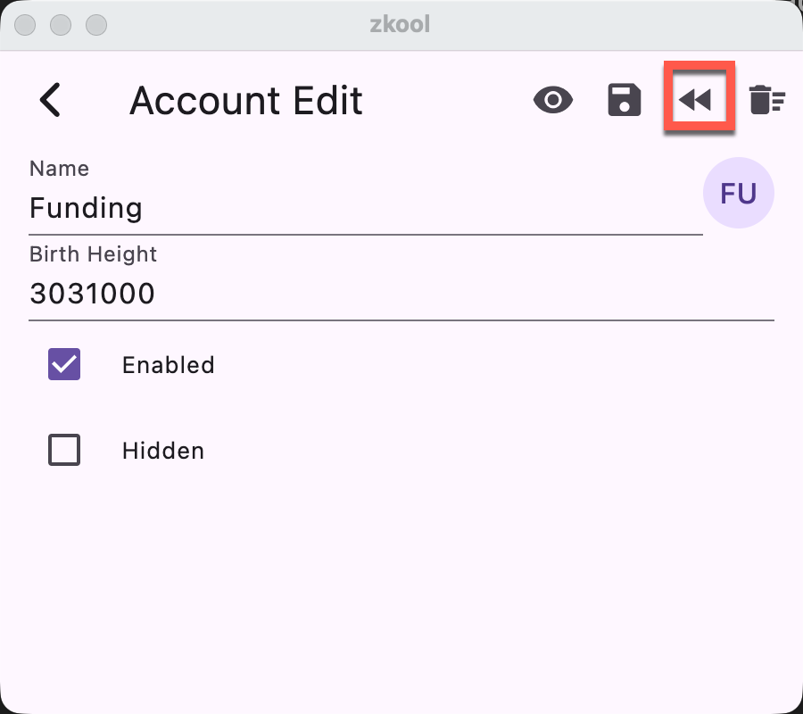

## Account

> An account does not sync automatically but others do.

It may be *disabled*. Edit the account properties and reenable it.

> An account disappeared from the list

It may be from a different database. Check that you are using the right one.
Also, it could be *hidden*. Tap the "Show hidden button".

## No Synchronization
> Synchronization does not start

- The Autosynchronization (autosync) checks every ~15-30 seconds. You may just need to wait a bit longer.
- Autosync starts when at least one account is behind by a number of blocks greater than the autosync interval.

This is so the app saves on bandwidth. The interval can be set to a lower value to sync more often. When set to 0, autosync is *disabled*.
- When you have multiple accounts, you will see that autosync starts with them and progressively include more accounts. For example, if A is synchronized to height 2m and B to 2.5m, sync starts with A between 2 and 2.5m. Then after 2.5m, both A and B are processed concurrently.

You can *manually* start a sync by tapping the sync button. On the account list
page, the sync button triggers the sync of every account *enabled*. You can
disable and reenable account by editing the account properties.

You can also sync a single account by tapping the sync button on the account
page.

## No Funds / Incorrect Balance

> If you see no funds at all it is likely caused by an *incorrect key*

Seed phrases have a "checksum" and use specific words from a list. If you
mispell a word, it will be invalid. Unfortunately, there is no error
correction. The app knows there is an error somewhere but cannot help you
correct the mistake. Make sure you write down the seed phrase exactly as
shown.

>  The *address index* could be wrong.

If you are sure you have the right seed phrase but still see no funds, it may be
because you do not have the right *account index*. Account indices start at 0.
If your original wallet had multiple accounts, it could have used an index
different than 0.

::: tip
ZECWallet Lite uses account indices when you generate additional shielded
addresses.
:::

Accounts that have the same address have the same key (and therefore the same
balance). *However accounts that have different addresses may also have the
same key* (using different diversified addresses or different receivers of the
UA). If your address in Zkool differs from the one in your original wallet app,
it may stil work.

> Your account may not be synchronized.

Manually Synchronize if the account height is behind.

> Your account birth height may be too high.

Zkool starts scanning block from the birth height. If it is too high, it will
miss the transactions that happened earlier. To solve it, edit the account birth
height, reset the synchronization data and finally resync.

> You may have transparent addresses that are not known by the app.

If you restore from a seed phrase a wallet that uses address rotation, it would
have generated additional transparent addresses. In this case, you need to scan
for these transparent addresses too. On the address page, tap the "Scan
Transparent Addresses" button and wait for the scan to finish. Then go to the
account edit page to reset the synchronization data and resync.

::: tip
Scanning takes a while. Please wait until a message says it is completed. It
will also report how many new addresses were found. You can also inspect which
transparent addresses are used by tapping on the "eye" icon.
:::

## Double Spend

> When I send the transaction, the server reports that a note has been used.

This is likely because Zkool was not synchronized to the latest block and
thought some of the notes were unused. Zkool does not mark notes as spent until
it sees them used in a block. In particular, making a tx does not mark the notes
as spent until it is mined.

> How do I make multiple tx in a row? After the first one, the server reports a
> double spend.

The easiest way is to batch the payments into a single transaction. You'd pay
less and it'd be faster. Note that it also links the payments since they are
likely made by the same person. If your tx involves transparent inputs/outputs
it could be an issue.

If you don't want to wait or do a multi recipient transaction, you can manually
exclude the notes from further spending in the note tab. That's rather tedious.

Notes in gray are excluded. Tap to toggle on and off.

## Duplicate Tx

A variant of the double spend is when the server reports that it has seen an
identical transaction. It could be because you have accidentally submitted it
twice. Just ignore the error.

## Transaction not mined

> A transaction was sent successfully and you have a tx id but it is not mined
> after a long time like 10 minutes. When you look at the mempool on a block
> explorer, you notice that your transaction is not there.

Your transaction is somehow incorrect but not properly rejected by the server
node. It is an issue with the server consensus so there is nothing much you can
do at the wallet level besides retrying. If the same thing happens again, try
using another server running a different node software.

## Bad Anchor

> When you prepare the transaction, Zkool returns an error related to a "bad
> anchor".

This is also probably related to an issue at the server where in case of a block
reorganization, it returns the older fork. Unfortunately, the bug hasn't been
identified because of its rarity but it seems to affect all wallet software.
Fortunately, you can fix the issue by rewinding the account to an earlier
checkpoint in the Edit page.

