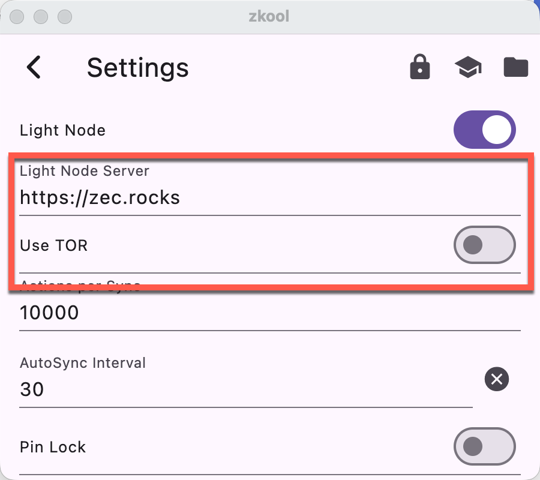

# What is TOR?

From the Wikipedia:

Tor is a free overlay network for enabling anonymous communication. It is built on free and open-source software run by over seven thousand volunteer-operated relays worldwide, as well as by millions of users who route their Internet traffic via random paths through these relays.

# Without TOR

The communication between Zkool and the server reveals some information about the wallet.

::: important
The protocol uses GRPC which is based on HTTP/2\. **Your IP
address is known to the server**.
:::

## Shielded Data

Getting blocks to decrypt shielded transactions is mostly passive. The server knows the range of requested blocks, and it's usually from the latest synchronized height up to the current/latest block height.

The server returns a stream of _compact_ blocks that contains the shielded part (it excludes any transparent transaction data).

The shielded data does not contain the memo and outgoing encrypted key. After Zkool identifies the data related to the account, it makes a series of requests to retrieve the full transaction data.

Getting _memos_ and the _outgoing addresses_ requires _targeted_ queries. The server can associate an IP with the transaction ID of the queries.

::: important
**Getting memos and addresses associates an IP address to the transaction IDs**.
:::

## Transparent Data

Transparent data is pruned from the compact blocks fetched from the server, therefore Zkool needs to get them separately. The server indexes the transparent data and it can only be queried directly by address.

::: important
Even if you do not use the transparent address of your account, Zkool needs to
query them in case you have. **The server can associate the IP with the
transparent addresses**. If you don't need the transparent address, you should
remove the transparent pool from the account, then Zkool will not request them.
:::

# With TOR

With TOR enabled, Zkool builds a circuit: It picks 3 random Tor relays from its global network.

- Entry (Guard) node, first hop, sees your IP address but not your destination server.
- Middle node, just passes encrypted data, doesn't know you or the server.
- Exit node, last hop, decrypts the traffic and sends it to the light wallet server.

**Your IP is hidden**. The server only sees the exit node's IP. **Latency is higher**. Because traffic bounces through ~3 relays worldwide. Tor ensures privacy between you and the network, but exit node traffic must rely on HTTPS for end-to-end encryption.

Zkool uses TOR for all the traffic between it and the lightwallet server.

::: important
Zkool does not use TOR to get the market price and the price chart.
:::

## Onion Service
There is no exit node at all.

Instead, the server itself is inside Tor. Both client and server use special Tor circuits to meet at a rendezvous point:

You build a Tor circuit (entry to middle to rendezvous point). The onion service
builds its own Tor circuit (entry to middle to same rendezvous point).

Neither side knows the other’s IP. They only meet inside Tor. Traffic is end-to-end encrypted inside Tor (not just between you and the network).

The .onion address itself is a cryptographic identifier derived from the
service’s public key, ensuring authenticity.

::: tip
If you have a lightwallet server that has a onion service address, it provides
better privacy because the TOR circuit won't use an exit node.
:::
