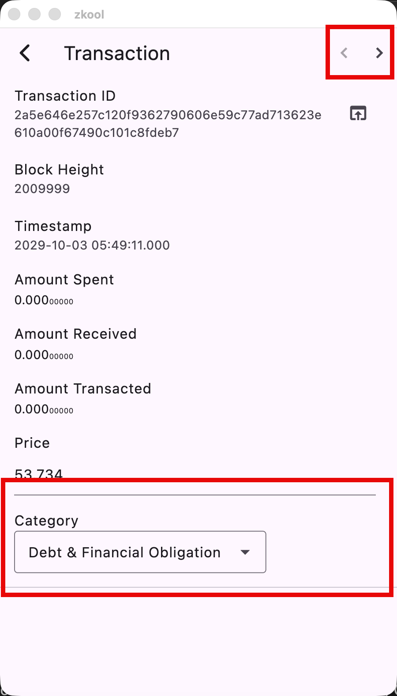
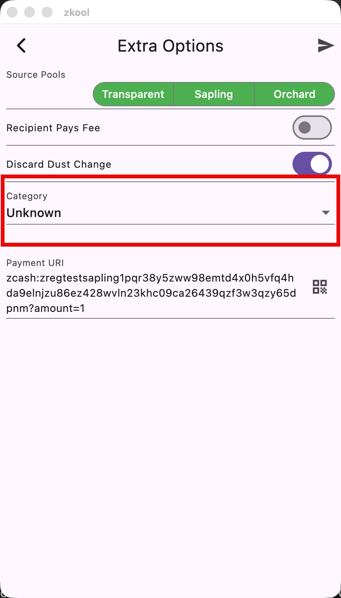

# Assigning a Category

## Old Transactions
For transactions that have been mined and are part of your account history:

::: tip
Navigate through your transaction history quickly using the arrows.
:::

## New Payments
When you make a payment, you can assign a category too.

# Managing Categories

Zkool comes with a list of predefined categories, but you can make your own list.

Open the category editor from the account manager page.

The List of Categories shows up. Like the Folder Manager, add new categories
with the "+" button on the app bar.

Add, Edit and Delete categories by first selecting them and using the associated
button on the app bar.

