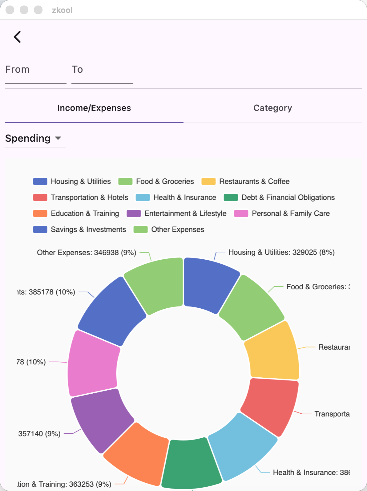
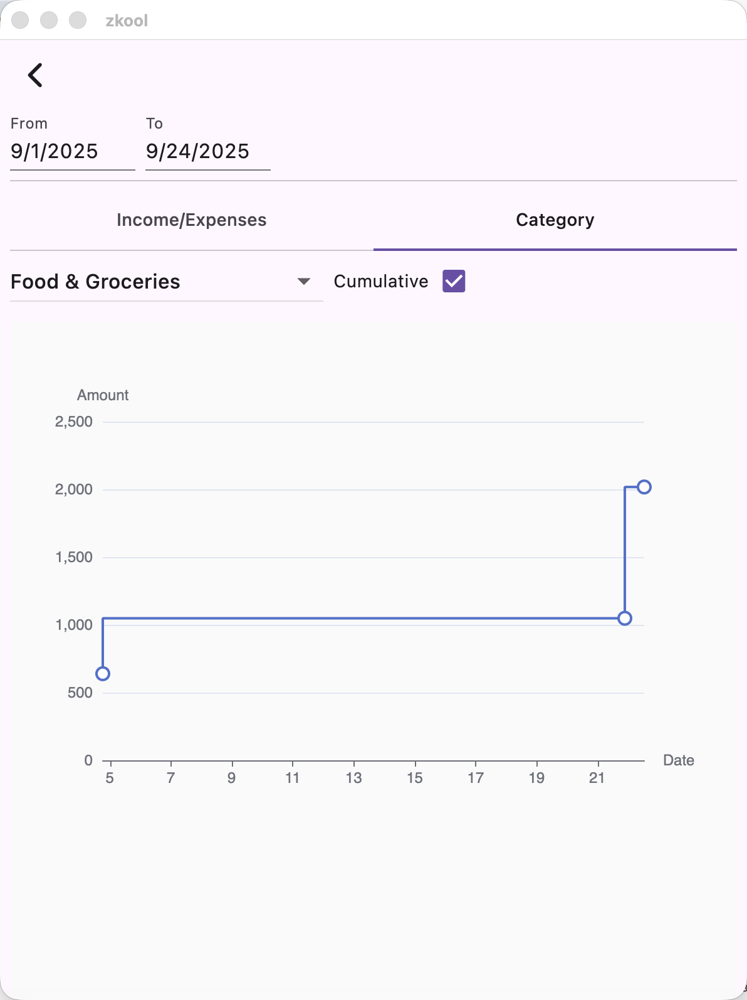

Zkool currently has two report charts[^1]. Both of them can be limited to a
given time period.

## Income/Expense By Category

This is a pie chart that shows your total of income or expenses by category.

- Switch between Income and Expenses with the dropdown.

## Category by Time

Given a category, this chart plots your spending (or income) on a time axis. If
the cumulative box is checked, it shows how the total amount in the given
category grows over time.

[^1]: More charts will be added later.
