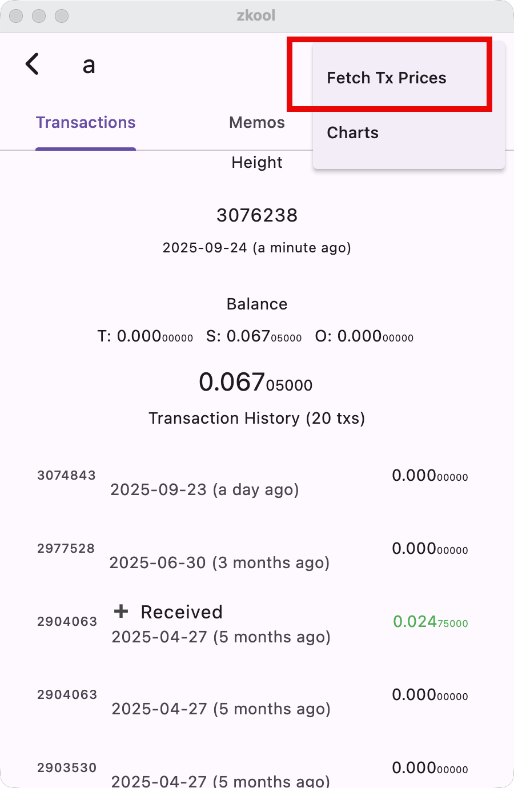

The expense and income reports use USD because at this time nearly all of the
services use fiat. To convert between ZEC and USD, each transaction must have
the price of 1 ZEC in USD. When you make a payment, you can enter the ZEC price
or fetch it from CoinGecko. It will get recorded with the transaction in your
account[^1].

Zkool can also automatically import historical prices from CoinGecko. However,
the public API only provides the current year of data. CoinGecko returns market
prices at different time intervals depending on the time range:
- Current Day: Every minute,
- From 2 to 90 days: Every hour,
- From 90 to 365 days: Every day.

If a transaction falls out of this range, it will get the oldest known market
price.

::: tip
You can adjust the market price of a transaction by editing the price in the
transaction details page.
:::

[^1]: ZEC prices and categories are not recorded on chain, therefore if you
    restore your wallet on a different device you will have to input the data
    again. It is much more convenient to save and restore the account with the
    Import/Export feature.
