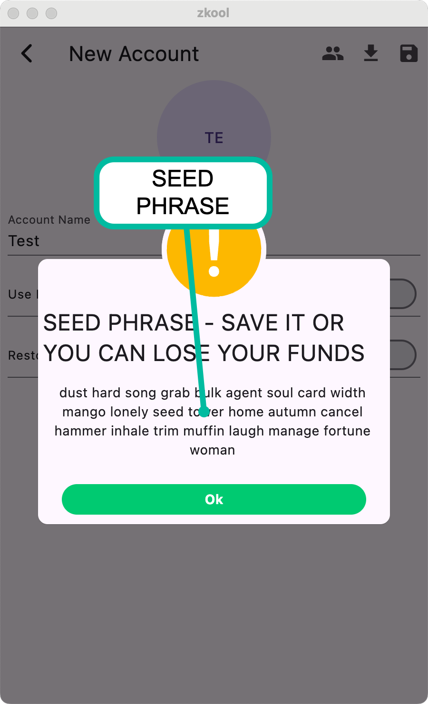

# Accounts & Databases

Zkool organizes groups of accounts into databases.
The default database is called `zkool`. You can create
and change databases in the settings page (accessible
via the "cog" icon on the app bar).

Databases can be *encrypted* on disk[^1].

```admonish warning
After you
change the name of the database, you must **restart**
the app for it to take effect.
```

On the first launch,
you will be asked to choose a password[^2].

The default database "zkool" cannot be encrypted.

A database contains any number of accounts (starting with none).

To create (and add) an account, tap on the "+" button on the app bar.
It opens the new account page.

## New blank account (not a recovery)

- Enter the name you want to associate with this account[^3]
- Optionally, upload a PNG/JPG icon
- If you want the account to follow ZIP316 (i.e. like Zashi)
check the "Use Internal Change" option. If you want it to work
like Ywallet, leave it unchecked[^4].
- Then tap on the "Save" button.

ZKool will show you the account SEED PHRASE.

```admonish warning
The account seed phrase are the 24 words that **uniquely**
forms the "password" for your funds.
**You cannot recovery your wallet/account/funds if you do not
have the seed phrase.**
It is of critical importance to keep your seed phrase in a **safe
and secure** place. Anyone who has your seed phrase can spend your
funds. Spending on the blockchain is **irreversible**.

```



Be careful when people who want to "help" you ask for your
seed phrase. They are likely scammers looking to steal your funds.
They do not need access to your computer. If they know your seed phrase,
they can use their computer. Treat a seed phrase like it is the **master
password** to your online banking.

```admonish warning
The author of this wallet will never ask you for your seed phrase[^5].
```

## Recovery

You need to have the account **seed phrase**[^6] (or one of the other
supported secret/viewing key).

In addition, knowing the block height when the account was created,
**the birth height**
helps since the app will skip downloading and processing blocks
before this height.
It greatly speeds up recovery because there were a very large
number of transactions during the years 2022-2023.

For more advanced recovery scenarios, check out the
[Recovery](../advanced/recovery.md) section.

After creating the account, you probably want to **synchronize**
it to get the transaction history and the current balance.

[^1]: Encryption is encouraged but not mandatory.
Encryption is "at rest" on disk. At no point is
the database decrypted. This protects the system
from malware that steals the database file. However,
if the system is also infected with a keylogger,
the password may be captured when input by the user.
[^2]: To change or remove the database password, you
have to switch to a different database first. Then,
go to the settings page, enter the database name you
want to change and tap the "change database password"
button. It is not possible to change the password
of the current database.
[^3]: Accounts are stored locally on your device. **Zkool
does not use cloud servers and never uploads any data**.
[^4]: Use must check this option if you are recovering
a Zashi account from seed phrase.
[^5]: Except maybe for debugging on a small amount.
[^6]: See the section on Keys.
