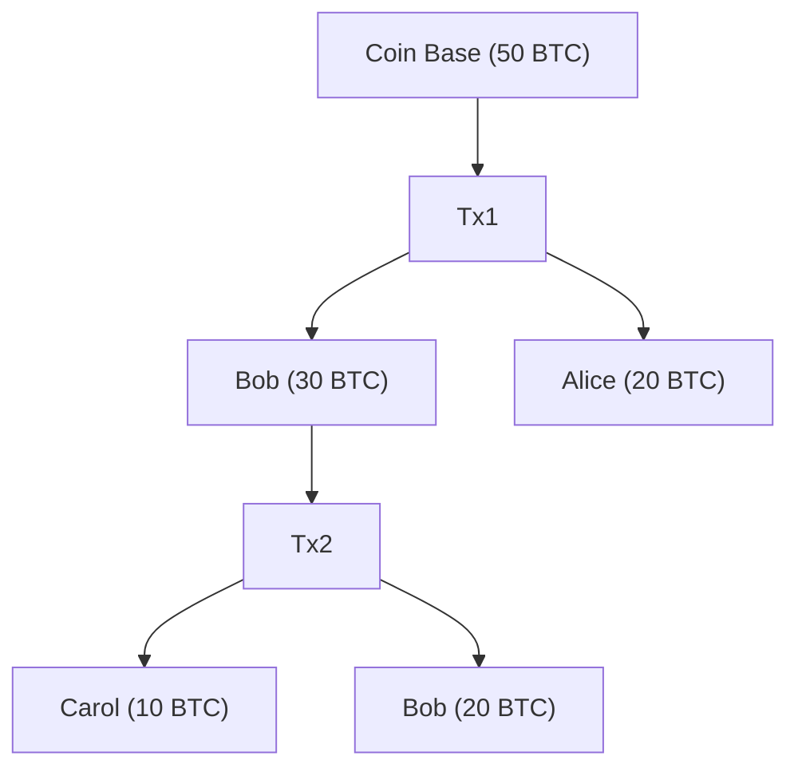

## Nodes in the Transaction Graph

Each node is a transaction.

Some papers and tools also model each UTXO as a node instead (this is called the
UTXO graph).

## Edges in the graph

An edge represents the flow of value:

If a transaction A creates an output (UTXO), and a later transaction B uses that
output as an input, you draw a directed edge from A → B.

This captures the fact that B depends on A.

## Graph structure

It’s a directed acyclic graph (DAG):

Transactions only point forward in time (can’t spend future coins).

No cycles, because once an output is spent, it cannot be recreated.

All transaction paths ultimately lead back to:

Coinbase transactions (block rewards), which are the origin of all bitcoins.

## What the graph shows

Flow of coins: You can trace any satoshi (or UTXO) back to its origin.

Clustering analysis: Because outputs can be linked when spent together, analysts
can try to infer common ownership.

Network health: Graph analysis is used in forensics, compliance, and research.

5. Example

Imagine:

- Tx1: Coinbase creates 50 BTC → Output A.
- Tx2: Uses A (50 BTC) as input → sends 30 BTC to Bob, 20 BTC back to Alice.
- Tx3: Uses Bob’s 30 BTC to pay Carol 10 BTC and himself 20 BTC.

The graph would look like:

In summary:
> The transaction graph is a DAG connecting all Bitcoin transactions by their
> input/output relationships. It’s the backbone for tracing funds, analyzing
> usage patterns, and enforcing Bitcoin’s rule that each UTXO can be spent only
> once.
