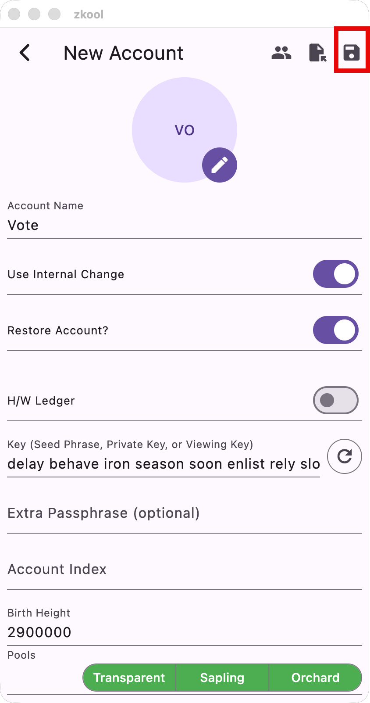
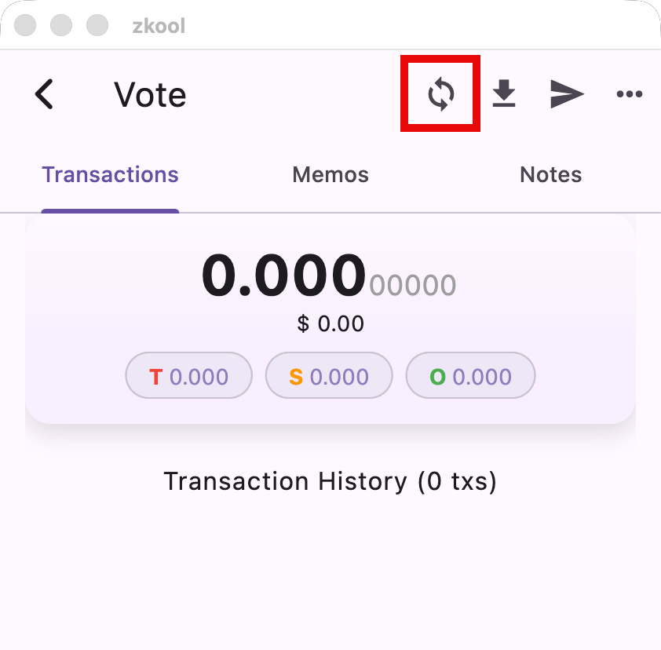
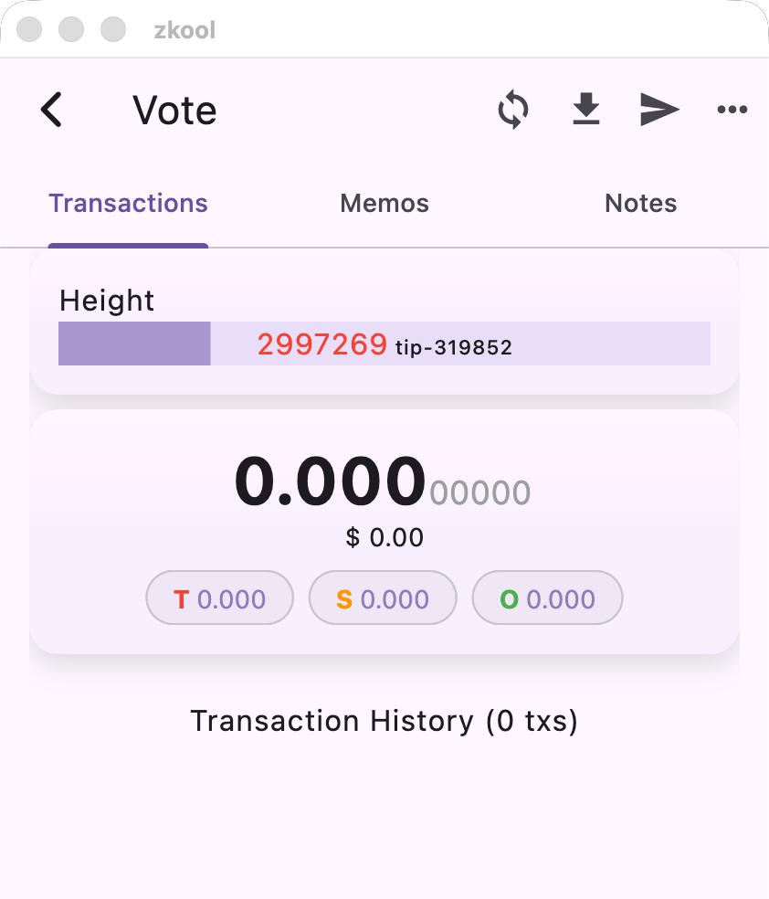
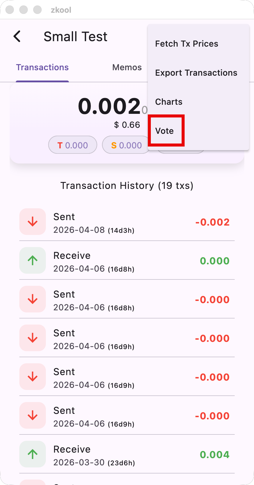
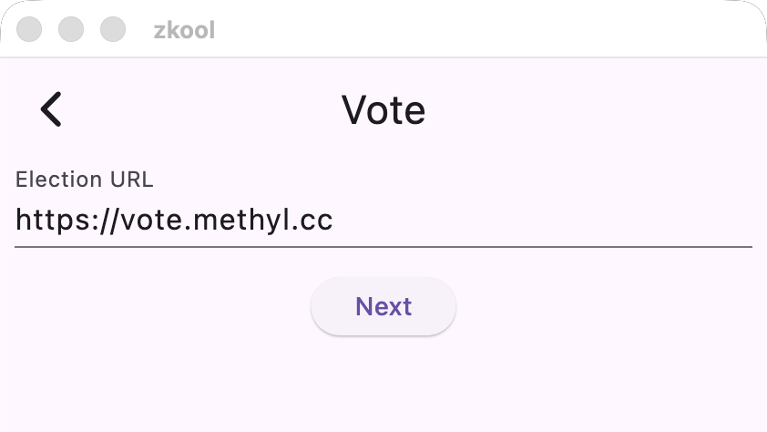
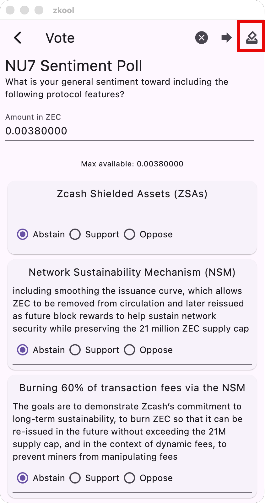
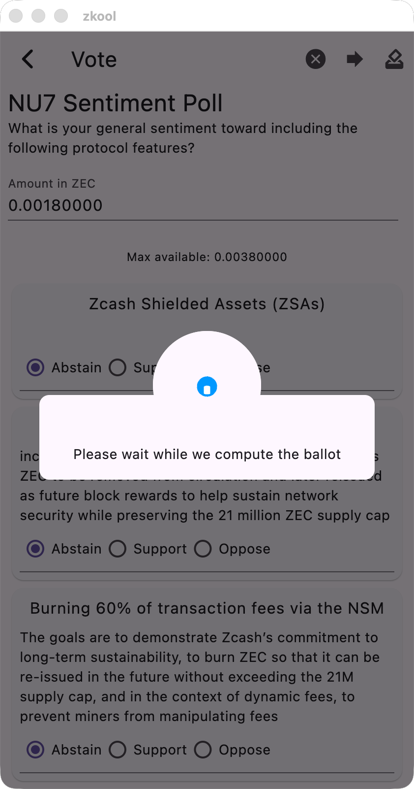
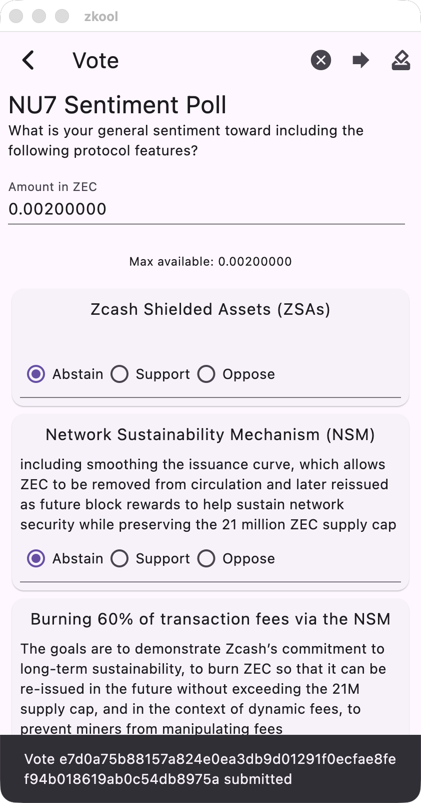
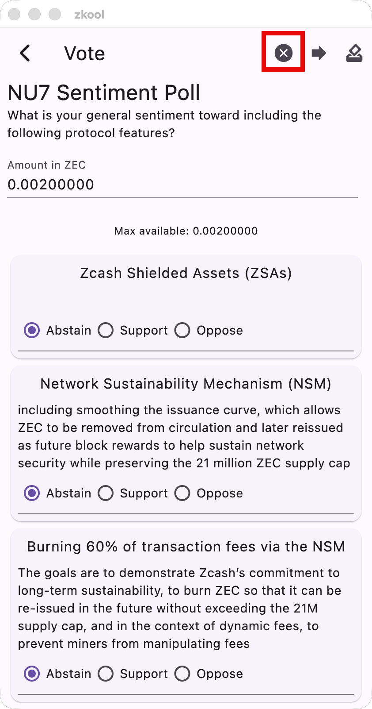

## Summary
- Download & Run Zkool
- Import your wallet
- Synchronize
- Connect to the Election
- Fill your Ballot
- Submit
- Receipt
- Close

## Download Zkool

Find Zkool on the mobile stores (Google Play Store and
Apple AppStore) under the name *zkool*.

Or, for a desktop version, on Github: [Releases](https://github.com/hhanh00/zkool2/releases/tag/zkool-v6.14.1)

## Import your Wallet

Open Zkool, and create a new account. From the accout manager page,
add a new account, choose a name and *check the Use Internal Change*
option if your wallet was created in ZODL/Zashi. Leave unchecked, if
it is from YWallet.

Check Restore Account, enter a seed phrase[^1] and a *birth height*.
The birth height saves you from having to synchronize from the activation
of the Orchard pool.

It should look like this:

Then click on the save icon on the app bar to continue.

Skip the scanning of additional transparent addresses, since voting
uses only Orchard funds (tap on Close)

The app should show your account on the main page. Tap on its name
and continue to the Account page.

## Synchronize

At this point, your account is restored but isn't synchronized yet.
Therefore the balance shows as 0.000 ZEC and the transaction history
is empty.

Let's synchronize by tapping on the sync button.

> Synchronization may take a while if there are a lot of blocks to
process.

At the end, you should see your current wallet balance and your
transaction history.

## Connect to the Election

To start voting, choose the Vote option in the App Menu (...)

You will be asked for a URL. This is given by the organization
that sets up the election/poll.

For example, the test election is hosted on **https://vote.methyl.cc**

Then tap "Next".

After a short wait, you will see the Ballot Page.

## Fill your Ballot

On the ballot page, choose the amount of ZEC that you want to vote with.
By default, it is the total amount of ZEC that you have in your Orchard
pool at the *snapshot height*. This may not be your current balance
if you have made transactions after that time.

Fill the rest of the ballot, and then press the Submit button.

## Ballot Submission

Once you confirm your submission, the app will compute a digital
ballot and send it to the server.

On success, you receive a ballot ID and your voting balance gets
updated.

:::important
Computing a ballot may take a few minutes. Please leave the app
running and unlocked.
:::

## Receipt

> Thanks for voting!

## Close

When you are finished voting, you can delete
all of its data from the app with the Close button.

:::important
You can only vote from one account at a time. If you have multiple
wallets you want to vote with, you need to repeat this process
and *close the election between each wallet*.
:::

[^1]: Optionally an account derivation index and passphrase if you have
one.