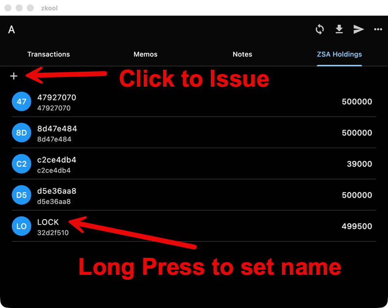
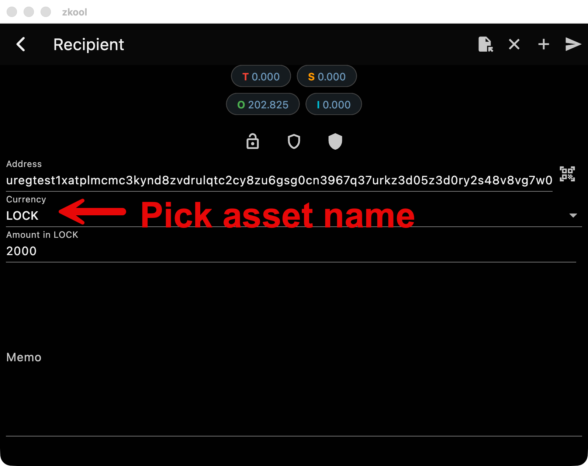

# Using ZSA with Zkool

ZSA can be used from two perspectives: through the wallet app, or through the
GraphQL API for applications.

## User perspective: wallet driven

### Prerequisites

- Use a database name containing `zsa` and connect the wallet
the ZSA testnet LWD server: `https://zsa.methyl.cc`
- Get tZEC test funds from the faucet to pay fees at the
[ZSA faucet](https://faucet.zsa.methyl.cc)

### Step by step

1. Open **Settings**.
2. Tap the **folder** icon next to the database name. The app schedules the
   database manager to open on the next launch, then *manually restart the app*.
3. In the **Database Manager**, tap **Create a new database**.
4. Enter a name containing `zsa` (e.g. `zsa` or `zsa-testnet`). The name is
   what selects the ZSA testnet network.
5. Set a password if desired; leave blank for no password.
6. Tap on the new item in the list to open the database.
7. In **Settings**, set the **Server URL** to `https://zsa.methyl.cc`.
8. Create an account with the "+" button.

The account is empty until it is funded with tZEC from the faucet and
synchronized.

### Issue an asset

In the wallet, issue an asset by giving it a name and an amount. The amount
must be an integer, asset amounts cannot have decimals. The asset is
identified by the issuer's validating key and the hash of its name. In the
current implementation, every asset is finalized at issuance, reissuance is
not yet supported.

::: important
**You MUST NOT issue the same token name from the same wallet twice**.
Currently, it breaks the server.
:::

### Asset names

The protocol does not include asset names, only the asset ID. The name is
therefore only known by its issuer. When you receive an asset, you can assign
your own name to it in the wallet, and it does not have to be the name the
issuer gave.



### Transfer assets

Once issued, the asset appears in the wallet's balances and can be sent to any
shielded address, just like a ZEC payment. Except that, as with issuance,
amounts must be integers. Transfers stay confidential, while the total supply
remains publicly verifiable because issuance notes are plaintext.



## Developer perspective: API driven

`zkool_graphql` exposes wallet functionality: accounts, synchronization,
issuance, and payments, over GraphQL. Build it from source and connect it to a
ZSA-enabled lightwalletd (see the [build guide](../graphql/build)).

### Setup

```sh
cd rust
cargo b -r --features=graphql --bin zkool_graphql
```

Configure the server with the path to the database, the ZSA testnet
lightwalletd URL, and the listening port:

```toml
db_path = "zkool.db"
lwd_url = "https://zsa.methyl.cc"
port = 8000
# coin type: 3 selects the ZSA testnet network
coin = 3
```

[GraphIQL](../graphql/graphiql) is an interactive test page embedded in the
server, available at `http://localhost:8000/graphiql`.

### Core flow

**1. Create an account**

```graphql
mutation {
  createAccount(newAccount: {
     name: "Issuer"
     useInternal: true
     key: ""
     aindex: 0
  })
}
```

**2. Synchronize it**

```graphql
mutation {
  synchronize(idAccounts: [1])
}
```

**3. Check the balance**

The ZEC balance comes from `balanceByAccount`:

```graphql
query {
  balanceByAccount(idAccount: 1) {
    height
    total
  }
}
```

Asset balances are a different query: `assets` returns one entry per asset
with its unspent balance (ZEC is included as well):

```graphql
query {
  assets(idAccount: 1) {
    idAsset
    assetName
    assetDescHash
    finalized
    balance
  }
}
```

**4. Issue an asset**

```graphql
mutation {
  issueAsset(idAccount: 1, assetName: "taz", amount: "1000", firstIssuance: true, finalize: true)
}
```

The mutation returns the transaction ID of the issuance transaction. The
`amount` is an integer string: asset amounts cannot have decimals.

In the
current implementation, `firstIssuance` and `finalize` must both be `true`.

::: important
**You MUST NOT issue the same token name from the same wallet
twice**. Currently, it breaks the server.
:::

**5. Pay fees and transfer**

Fees and payments use the regular `pay` mutation, which takes a list of
recipients with addresses and amounts (see [Sending Funds](../graphql/payments)):

```graphql
mutation {
  pay(idAccount: 1,
  payment:  {
     recipients:  [{
        address: "uregtest..."
        amount: "0.0001"
     }]
     srcPools: 7
  })
}
```

To transfer a custom asset, set `assetDesc` on the recipient. It can be the
asset name or a hex prefix of the asset desc hash; omit it (or use `""`) for
ZEC. Asset amounts are integers, not decimal amounts:

```graphql
mutation {
  pay(idAccount: 1,
  payment:  {
     recipients:  [{
        address: "uregtest..."
        assetDesc: "taz"
        amount: "1000"
     }]
  })
}
```

**6. Name a received asset**

Because the protocol does not transmit asset names, the name has to be set
locally. Use `setAssetName` with the asset ID returned by the asset queries:

```graphql
mutation {
  setAssetName(idAsset: 1, name: "taz")
}
```
